# Complete Application Documentation

## Indian E-commerce and Service Booking Platform

A full-stack marketplace where customers can shop for products, book services, manage orders, and interact with shops or service providers in real time.

---

## Table of Contents

1. [Application Overview](#1-application-overview)
2. [Technology Stack](#2-technology-stack)
3. [Project Structure](#3-project-structure)
4. [System Architecture](#4-system-architecture)
5. [Database Schema](#5-database-schema)
6. [User Roles & Permissions](#6-user-roles--permissions)
7. [Authentication Flows](#7-authentication-flows)
8. [API Endpoints Reference](#8-api-endpoints-reference)
9. [Application Workflows](#9-application-workflows)
10. [Client Application](#10-client-application)
11. [Background Jobs & Realtime](#11-background-jobs--realtime)
12. [Configuration Reference](#12-configuration-reference)
13. [Deployment Guide](#13-deployment-guide)

---

## 1. Application Overview

### Purpose
An all-in-one rural-first marketplace platform designed for the Indian market, featuring:
- **Product Marketplace**: Browse and order products from local shops
- **Service Booking**: Book services from local providers
- **Shop Management**: Shop owners can manage inventory, workers, and orders
- **Service Provider Dashboard**: Service providers can manage services and bookings
- **Admin Console**: Platform-wide monitoring, user management, and auditing

### Key Features
- Rural-first phone + PIN authentication with optional Firebase OTP
- Multi-language support (default: Tamil)
- Real-time updates via Server-Sent Events (SSE)
- Pay-later support for trusted customers
- Text-based orders for shops (open order mode)
- Worker sub-accounts with permission-based access
- Product reviews and service reviews
- Promotions and discount codes
- Return/refund management
- E-receipts for completed transactions

---

## 1.5 User Journeys & Business Logic

This section explains **how the application works** from each user's perspective, including the complete flows and interactions between customers, shops, providers, and workers.

### 1.5.1 Customer Journey

#### Getting Started as a Customer

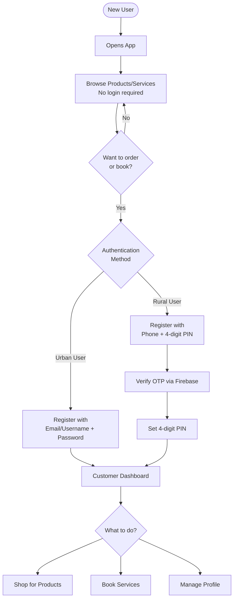
```mermaid
flowchart TD
    START([New User]) --> LANDING[Opens App]
    LANDING --> BROWSE_PUBLIC[Browse Products/Services<br/>No login required]
    
    BROWSE_PUBLIC --> WANT_ACTION{Want to order<br/>or book?}
    WANT_ACTION -->|Yes| AUTH_CHOICE{Authentication<br/>Method}
    WANT_ACTION -->|No| BROWSE_PUBLIC
    
    AUTH_CHOICE -->|Urban User| STD_REG[Register with<br/>Email/Username + Password]
    AUTH_CHOICE -->|Rural User| RURAL_REG[Register with<br/>Phone + 4-digit PIN]
    
    STD_REG --> LOGGED_IN[Customer Dashboard]
    RURAL_REG --> OTP[Verify OTP via Firebase]
    OTP --> SET_PIN[Set 4-digit PIN]
    SET_PIN --> LOGGED_IN
    
    LOGGED_IN --> ACTIONS{What to do?}
    ACTIONS --> SHOP[Shop for Products]
    ACTIONS --> BOOK[Book Services]
    ACTIONS --> PROFILE[Manage Profile]
```

#### Complete Product Shopping Flow

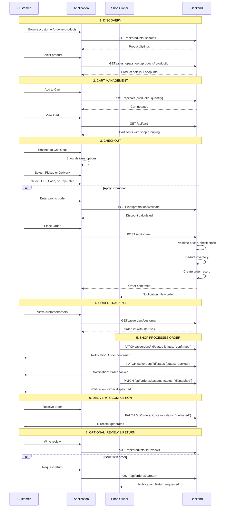
```mermaid
sequenceDiagram
    participant C as Customer
    participant App as Application
    participant Shop as Shop Owner
    participant System as Backend

    Note over C,System: 1. DISCOVERY
    C->>App: Browse /customer/browse-products
    App->>System: GET /api/products?search=...
    System-->>App: Product listings
    
    C->>App: Select product
    App->>System: GET /api/shops/:shopId/products/:productId
    System-->>App: Product details + shop info
    
    Note over C,System: 2. CART MANAGEMENT
    C->>App: Add to Cart
    App->>System: POST /api/cart {productId, quantity}
    System-->>App: Cart updated
    
    C->>App: View Cart
    App->>System: GET /api/cart
    System-->>App: Cart items with shop grouping
    
    Note over C,System: 3. CHECKOUT
    C->>App: Proceed to Checkout
    App->>App: Show delivery options
    C->>App: Select: Pickup or Delivery
    C->>App: Select: UPI, Cash, or Pay-Later
    
    alt Apply Promotion
        C->>App: Enter promo code
        App->>System: POST /api/promotions/validate
        System-->>App: Discount calculated
    end
    
    C->>App: Place Order
    App->>System: POST /api/orders
    System->>System: Validate prices, check stock
    System->>System: Deduct inventory
    System->>System: Create order record
    System-->>App: Order confirmed
    System->>Shop: Notification: New order!
    
    Note over C,System: 4. ORDER TRACKING  
    C->>App: View /customer/orders
    App->>System: GET /api/orders/customer
    System-->>App: Order list with statuses
    
    Note over Shop,System: 5. SHOP PROCESSES ORDER
    Shop->>System: PATCH /api/orders/:id/status {status: "confirmed"}
    System->>C: Notification: Order confirmed
    
    Shop->>System: PATCH /api/orders/:id/status {status: "packed"}
    System->>C: Notification: Order packed
    
    Shop->>System: PATCH /api/orders/:id/status {status: "dispatched"}
    System->>C: Notification: Order dispatched
    
    Note over C,System: 6. DELIVERY & COMPLETION
    C->>App: Receive order
    Shop->>System: PATCH /api/orders/:id/status {status: "delivered"}
    System->>C: E-receipt generated
    
    Note over C,System: 7. OPTIONAL: REVIEW & RETURN
    C->>App: Write review
    App->>System: POST /api/products/:id/reviews
    
    alt Issue with order
        C->>App: Request return
        App->>System: POST /api/orders/:id/return
        System->>Shop: Notification: Return requested
    end
```

#### Complete Service Booking Flow

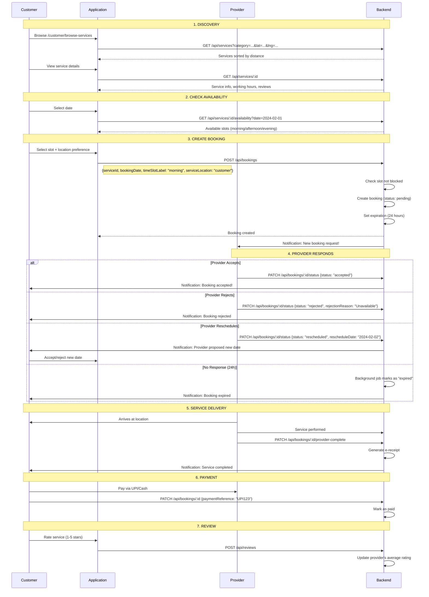
```mermaid
sequenceDiagram
    participant C as Customer
    participant App as Application
    participant P as Provider
    participant System as Backend

    Note over C,System: 1. DISCOVERY
    C->>App: Browse /customer/browse-services
    App->>System: GET /api/services?category=...&lat=...&lng=...
    System-->>App: Services sorted by distance
    
    C->>App: View service details
    App->>System: GET /api/services/:id
    System-->>App: Service info, working hours, reviews
    
    Note over C,System: 2. CHECK AVAILABILITY
    C->>App: Select date
    App->>System: GET /api/services/:id/availability?date=2024-02-01
    System-->>App: Available slots (morning/afternoon/evening)
    
    Note over C,System: 3. CREATE BOOKING
    C->>App: Select slot + location preference
    App->>System: POST /api/bookings
    Note right of App: {serviceId, bookingDate, timeSlotLabel: "morning", serviceLocation: "customer"}
    
    System->>System: Check slot not blocked
    System->>System: Create booking (status: pending)
    System->>System: Set expiration (24 hours)
    System-->>App: Booking created
    System->>P: Notification: New booking request!
    
    Note over P,System: 4. PROVIDER RESPONDS
    alt Provider Accepts
        P->>System: PATCH /api/bookings/:id/status {status: "accepted"}
        System->>C: Notification: Booking accepted!
    else Provider Rejects
        P->>System: PATCH /api/bookings/:id/status {status: "rejected", rejectionReason: "Unavailable"}
        System->>C: Notification: Booking rejected
    else Provider Reschedules
        P->>System: PATCH /api/bookings/:id/status {status: "rescheduled", rescheduleDate: "2024-02-02"}
        System->>C: Notification: Provider proposed new date
        C->>App: Accept/reject new date
    else No Response (24h)
        System->>System: Background job marks as "expired"
        System->>C: Notification: Booking expired
    end
    
    Note over C,System: 5. SERVICE DELIVERY
    P->>C: Arrives at location
    P->>System: Service performed
    P->>System: PATCH /api/bookings/:id/provider-complete
    System->>System: Generate e-receipt
    System->>C: Notification: Service completed
    
    Note over C,System: 6. PAYMENT
    C->>P: Pay via UPI/Cash
    C->>System: PATCH /api/bookings/:id {paymentReference: "UPI123"}
    System->>System: Mark as paid
    
    Note over C,System: 7. REVIEW
    C->>App: Rate service (1-5 stars)
    App->>System: POST /api/reviews
    System->>System: Update provider's average rating
```

### 1.5.2 Shop Owner Journey

#### Setting Up a Shop

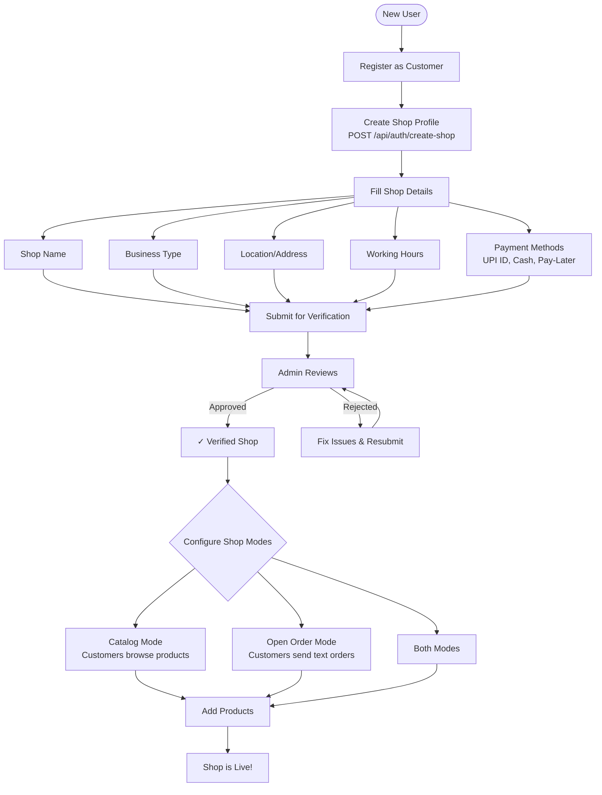
```mermaid
flowchart TD
    START([New User]) --> REG[Register as Customer]
    REG --> CREATE_SHOP[Create Shop Profile<br/>POST /api/auth/create-shop]
    CREATE_SHOP --> FILL_PROFILE[Fill Shop Details]
    
    FILL_PROFILE --> SHOP_NAME[Shop Name]
    FILL_PROFILE --> BUSINESS_TYPE[Business Type]
    FILL_PROFILE --> ADDRESS[Location/Address]
    FILL_PROFILE --> WORKING_HOURS[Working Hours]
    FILL_PROFILE --> PAYMENT[Payment Methods<br/>UPI ID, Cash, Pay-Later]
    
    SHOP_NAME & BUSINESS_TYPE & ADDRESS & WORKING_HOURS & PAYMENT --> VERIFY[Submit for Verification]
    VERIFY --> ADMIN[Admin Reviews]
    ADMIN -->|Approved| VERIFIED[✓ Verified Shop]
    ADMIN -->|Rejected| RESUBMIT[Fix Issues & Resubmit]
    RESUBMIT --> ADMIN
    
    VERIFIED --> SHOP_MODES{Configure Shop Modes}
    SHOP_MODES --> CATALOG[Catalog Mode<br/>Customers browse products]
    SHOP_MODES --> OPEN_ORDER[Open Order Mode<br/>Customers send text orders]
    SHOP_MODES --> BOTH[Both Modes]
    
    CATALOG & OPEN_ORDER & BOTH --> ADD_PRODUCTS[Add Products]
    ADD_PRODUCTS --> LIVE[Shop is Live!]
```

#### Daily Shop Operations

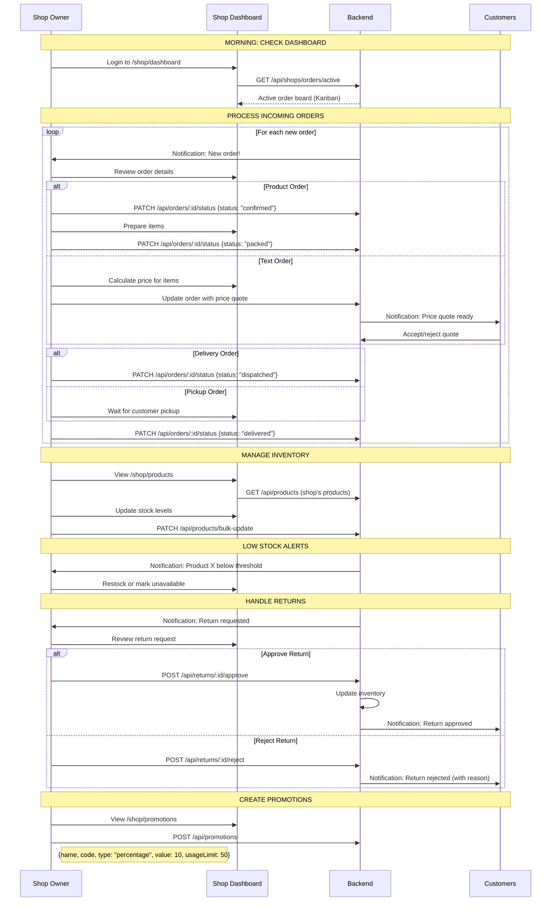
```mermaid
sequenceDiagram
    participant Owner as Shop Owner
    participant App as Shop Dashboard
    participant System as Backend
    participant Customer as Customers

    Note over Owner,Customer: MORNING: CHECK DASHBOARD
    Owner->>App: Login to /shop/dashboard
    App->>System: GET /api/shops/orders/active
    System-->>App: Active order board (Kanban)
    
    Note over Owner,Customer: PROCESS INCOMING ORDERS
    loop For each new order
        System->>Owner: Notification: New order!
        Owner->>App: Review order details
        
        alt Product Order
            Owner->>System: PATCH /api/orders/:id/status {status: "confirmed"}
            Owner->>App: Prepare items
            Owner->>System: PATCH /api/orders/:id/status {status: "packed"}
        else Text Order
            Owner->>App: Calculate price for items
            Owner->>System: Update order with price quote
            System->>Customer: Notification: Price quote ready
            Customer->>System: Accept/reject quote
        end
        
        alt Delivery Order
            Owner->>System: PATCH /api/orders/:id/status {status: "dispatched"}
        else Pickup Order
            Owner->>App: Wait for customer pickup
        end
        
        Owner->>System: PATCH /api/orders/:id/status {status: "delivered"}
    end
    
    Note over Owner,Customer: MANAGE INVENTORY
    Owner->>App: View /shop/products
    App->>System: GET /api/products (shop's products)
    Owner->>App: Update stock levels
    Owner->>System: PATCH /api/products/bulk-update
    
    Note over Owner,Customer: LOW STOCK ALERTS
    System->>Owner: Notification: Product X below threshold
    Owner->>App: Restock or mark unavailable
    
    Note over Owner,Customer: HANDLE RETURNS
    System->>Owner: Notification: Return requested
    Owner->>App: Review return request
    alt Approve Return
        Owner->>System: POST /api/returns/:id/approve
        System->>System: Update inventory
        System->>Customer: Notification: Return approved
    else Reject Return
        Owner->>System: POST /api/returns/:id/reject
        System->>Customer: Notification: Return rejected (with reason)
    end
    
    Note over Owner,Customer: CREATE PROMOTIONS
    Owner->>App: View /shop/promotions
    Owner->>System: POST /api/promotions
    Note right of Owner: {name, code, type: "percentage", value: 10, usageLimit: 50}
```

#### Managing Workers

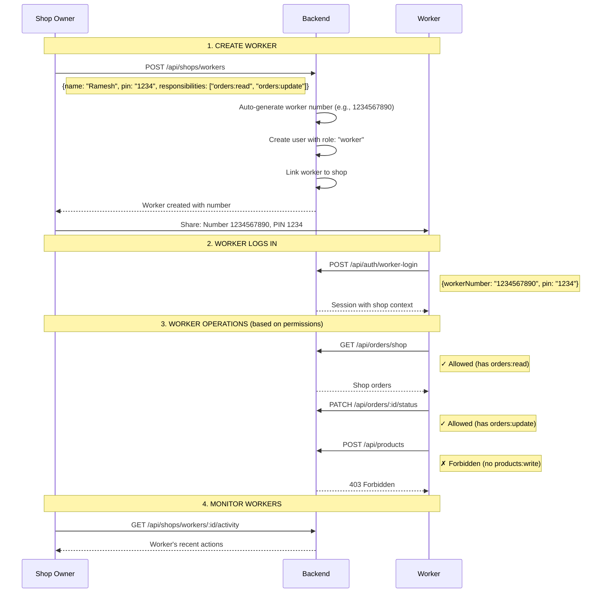
```mermaid
sequenceDiagram
    participant Owner as Shop Owner
    participant System as Backend
    participant Worker as Worker

    Note over Owner,Worker: 1. CREATE WORKER
    Owner->>System: POST /api/shops/workers
    Note right of Owner: {name: "Ramesh", pin: "1234", responsibilities: ["orders:read", "orders:update"]}
    System->>System: Auto-generate worker number (e.g., 1234567890)
    System->>System: Create user with role: "worker"
    System->>System: Link worker to shop
    System-->>Owner: Worker created with number
    Owner->>Worker: Share: Number 1234567890, PIN 1234
    
    Note over Owner,Worker: 2. WORKER LOGS IN
    Worker->>System: POST /api/auth/worker-login
    Note right of Worker: {workerNumber: "1234567890", pin: "1234"}
    System-->>Worker: Session with shop context
    
    Note over Owner,Worker: 3. WORKER OPERATIONS (based on permissions)
    Worker->>System: GET /api/orders/shop
    Note right of Worker: ✓ Allowed (has orders:read)
    System-->>Worker: Shop orders
    
    Worker->>System: PATCH /api/orders/:id/status
    Note right of Worker: ✓ Allowed (has orders:update)
    
    Worker->>System: POST /api/products
    Note right of Worker: ✗ Forbidden (no products:write)
    System-->>Worker: 403 Forbidden
    
    Note over Owner,Worker: 4. MONITOR WORKERS
    Owner->>System: GET /api/shops/workers/:id/activity
    System-->>Owner: Worker's recent actions
```

### 1.5.3 Service Provider Journey

#### Setting Up as a Provider

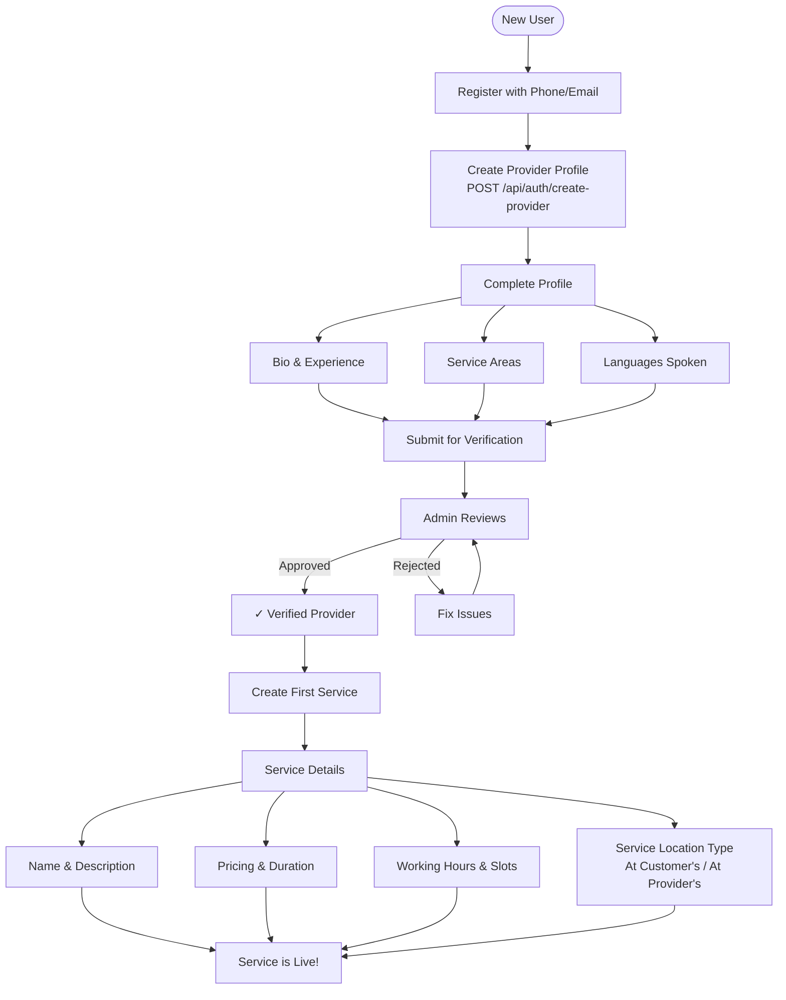
```mermaid
flowchart TD
    START([New User]) --> REG[Register with Phone/Email]
    REG --> CREATE_PROVIDER[Create Provider Profile<br/>POST /api/auth/create-provider]
    
    CREATE_PROVIDER --> FILL_PROFILE[Complete Profile]
    FILL_PROFILE --> BIO[Bio & Experience]
    FILL_PROFILE --> AREAS[Service Areas]
    FILL_PROFILE --> LANGUAGES[Languages Spoken]
    
    BIO & AREAS & LANGUAGES --> VERIFY[Submit for Verification]
    VERIFY --> ADMIN[Admin Reviews]
    ADMIN -->|Approved| VERIFIED[✓ Verified Provider]
    ADMIN -->|Rejected| RESUBMIT[Fix Issues]
    RESUBMIT --> ADMIN
    
    VERIFIED --> CREATE_SERVICE[Create First Service]
    CREATE_SERVICE --> SERVICE_DETAILS[Service Details]
    SERVICE_DETAILS --> NAME[Name & Description]
    SERVICE_DETAILS --> PRICING[Pricing & Duration]
    SERVICE_DETAILS --> SCHEDULE[Working Hours & Slots]
    SERVICE_DETAILS --> LOCATION[Service Location Type<br/>At Customer's / At Provider's]
    
    NAME & PRICING & SCHEDULE & LOCATION --> LIVE[Service is Live!]
```

#### Provider Daily Operations

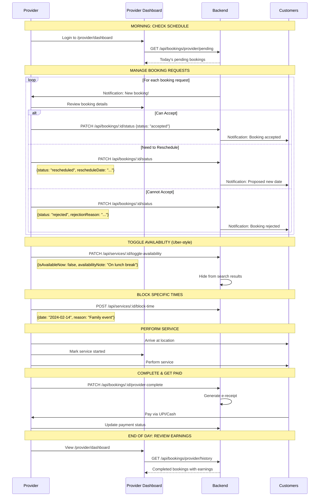
```mermaid
sequenceDiagram
    participant P as Provider
    participant App as Provider Dashboard
    participant System as Backend
    participant C as Customers

    Note over P,C: MORNING: CHECK SCHEDULE
    P->>App: Login to /provider/dashboard
    App->>System: GET /api/bookings/provider/pending
    System-->>App: Today's pending bookings
    
    Note over P,C: MANAGE BOOKING REQUESTS
    loop For each booking request
        System->>P: Notification: New booking!
        P->>App: Review booking details
        
        alt Can Accept
            P->>System: PATCH /api/bookings/:id/status {status: "accepted"}
            System->>C: Notification: Booking accepted
        else Need to Reschedule
            P->>System: PATCH /api/bookings/:id/status
            Note right of P: {status: "rescheduled", rescheduleDate: "..."}
            System->>C: Notification: Proposed new date
        else Cannot Accept
            P->>System: PATCH /api/bookings/:id/status
            Note right of P: {status: "rejected", rejectionReason: "..."}
            System->>C: Notification: Booking rejected
        end
    end
    
    Note over P,C: TOGGLE AVAILABILITY (Uber-style)
    P->>System: PATCH /api/services/:id/toggle-availability
    Note right of P: {isAvailableNow: false, availabilityNote: "On lunch break"}
    System->>System: Hide from search results
    
    Note over P,C: BLOCK SPECIFIC TIMES
    P->>System: POST /api/services/:id/block-time
    Note right of P: {date: "2024-02-14", reason: "Family event"}
    
    Note over P,C: PERFORM SERVICE
    P->>C: Arrive at location
    P->>App: Mark service started
    P->>C: Perform service
    
    Note over P,C: COMPLETE & GET PAID
    P->>System: PATCH /api/bookings/:id/provider-complete
    System->>System: Generate e-receipt
    C->>P: Pay via UPI/Cash
    P->>System: Update payment status
    
    Note over P,C: END OF DAY: REVIEW EARNINGS
    P->>App: View /provider/dashboard
    App->>System: GET /api/bookings/provider/history
    System-->>App: Completed bookings with earnings
```

### 1.5.4 Interaction Flows Between Users

#### Customer ↔ Shop Interaction

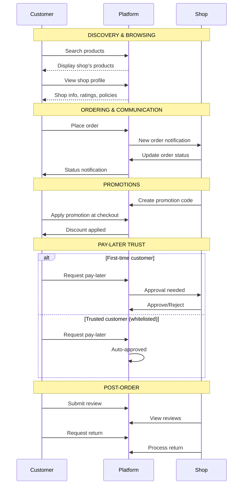
```mermaid
sequenceDiagram
    participant C as Customer
    participant System as Platform
    participant S as Shop

    Note over C,S: DISCOVERY & BROWSING
    C->>System: Search products
    System-->>C: Display shop's products
    C->>System: View shop profile
    System-->>C: Shop info, ratings, policies
    
    Note over C,S: ORDERING & COMMUNICATION
    C->>System: Place order
    System->>S: New order notification
    S->>System: Update order status
    System->>C: Status notification
    
    Note over C,S: PROMOTIONS
    S->>System: Create promotion code
    C->>System: Apply promotion at checkout
    System->>C: Discount applied
    
    Note over C,S: PAY-LATER TRUST
    alt First-time customer
        C->>System: Request pay-later
        System->>S: Approval needed
        S->>System: Approve/Reject
    else Trusted customer (whitelisted)
        C->>System: Request pay-later
        System->>System: Auto-approved
    end
    
    Note over C,S: POST-ORDER
    C->>System: Submit review
    S->>System: View reviews
    C->>System: Request return
    S->>System: Process return
```

#### Customer ↔ Provider Interaction

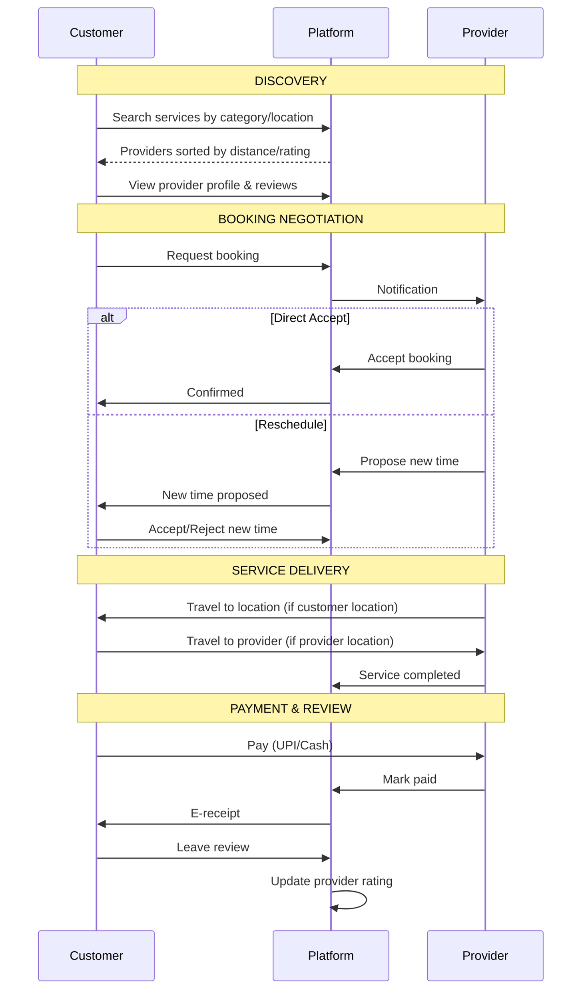
```mermaid
sequenceDiagram
    participant C as Customer
    participant System as Platform
    participant P as Provider

    Note over C,P: DISCOVERY
    C->>System: Search services by category/location
    System-->>C: Providers sorted by distance/rating
    C->>System: View provider profile & reviews
    
    Note over C,P: BOOKING NEGOTIATION
    C->>System: Request booking
    System->>P: Notification
    
    alt Direct Accept
        P->>System: Accept booking
        System->>C: Confirmed
    else Reschedule
        P->>System: Propose new time
        System->>C: New time proposed
        C->>System: Accept/Reject new time
    end
    
    Note over C,P: SERVICE DELIVERY
    P->>C: Travel to location (if customer location)
    C->>P: Travel to provider (if provider location)
    P->>System: Service completed
    
    Note over C,P: PAYMENT & REVIEW
    C->>P: Pay (UPI/Cash)
    P->>System: Mark paid
    System->>C: E-receipt
    C->>System: Leave review
    System->>System: Update provider rating
```

### 1.5.5 Platform Fee & Payment Logic

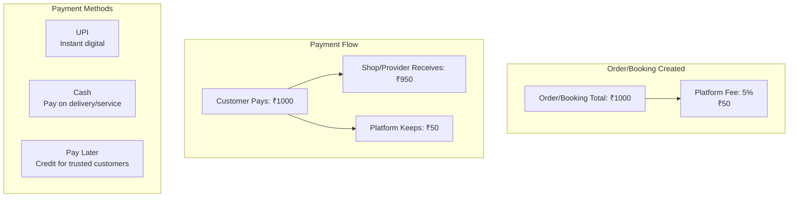
```mermaid
flowchart TD
    subgraph "Order/Booking Created"
        TOTAL[Order/Booking Total: ₹1000]
        FEE[Platform Fee: 5%<br/>₹50]
        TOTAL --> FEE
    end
    
    subgraph "Payment Flow"
        CUSTOMER[Customer Pays: ₹1000]
        SHOP_GETS[Shop/Provider Receives: ₹950]
        PLATFORM_GETS[Platform Keeps: ₹50]
        CUSTOMER --> SHOP_GETS
        CUSTOMER --> PLATFORM_GETS
    end
    
    subgraph "Payment Methods"
        UPI[UPI<br/>Instant digital]
        CASH[Cash<br/>Pay on delivery/service]
        PAY_LATER[Pay Later<br/>Credit for trusted customers]
    end
```

### 1.5.6 Notification System Logic

All users receive real-time notifications for relevant events:

| Event | Customer | Shop Owner | Provider | Worker |
|-------|:--------:|:----------:|:--------:|:------:|
| New order placed | - | ✓ | - | ✓* |
| Order status changed | ✓ | - | - | - |
| New booking request | - | - | ✓ | - |
| Booking status changed | ✓ | - | - | - |
| Return requested | - | ✓ | - | ✓* |
| Low stock alert | - | ✓ | - | ✓* |
| Payment reminder | ✓ | - | - | - |
| New review | - | ✓ | ✓ | - |
| Promotion expiring | - | ✓ | - | - |

*Workers only receive if they have relevant permissions


## 2. Technology Stack

### Backend
| Technology | Purpose |
|------------|---------|
| **Node.js 20.x** | Runtime environment |
| **Express.js** | HTTP server framework |
| **TypeScript** | Type-safe development |
| **PostgreSQL 14+** | Primary database |
| **Drizzle ORM** | Database ORM and migrations |
| **Redis** | Caching, sessions, job queues, realtime |
| **BullMQ** | Background job processing |
| **Passport.js** | Authentication |
| **Pino** | Structured logging |

### Frontend
| Technology | Purpose |
|------------|---------|
| **React 18** | UI framework |
| **TypeScript** | Type-safe development |
| **Vite** | Build tool and dev server |
| **TanStack Query** | Server state management |
| **Tailwind CSS** | Styling |
| **Wouter** | Routing |
| **Capacitor** | Android mobile builds |

### External Services
| Service | Purpose |
|---------|---------|
| **Firebase Phone Auth** | OTP verification (optional) |

---

## 3. Project Structure

```
full_stack_app/
├── client/                    # React frontend
│   ├── src/
│   │   ├── components/        # Reusable UI components (70+ files)
│   │   ├── contexts/          # React context providers
│   │   ├── hooks/             # Custom React hooks
│   │   ├── lib/               # Utility libraries (API, Firebase, etc.)
│   │   ├── pages/             # Page components
│   │   │   ├── admin/         # Admin dashboard pages
│   │   │   ├── auth/          # Authentication pages
│   │   │   ├── customer/      # Customer-facing pages
│   │   │   ├── provider/      # Service provider pages
│   │   │   └── shop/          # Shop owner pages
│   │   └── types/             # TypeScript type definitions
│   └── index.html
├── server/                    # Express backend
│   ├── routes.ts              # Main API routes (7890 lines)
│   ├── routes/                # Modular route handlers
│   │   ├── admin.ts           # Admin-specific routes
│   │   ├── bookings.ts        # Booking routes
│   │   ├── orders.ts          # Order routes
│   │   ├── promotions.ts      # Promotion routes
│   │   └── workers.ts         # Worker management routes
│   ├── auth.ts                # Authentication logic
│   ├── pg-storage.ts          # PostgreSQL storage layer
│   ├── cache.ts               # Redis caching
│   ├── realtime.ts            # SSE and Redis pub/sub
│   ├── jobQueue.ts            # BullMQ job queue
│   ├── jobs/                  # Background job handlers
│   ├── security/              # Security middleware
│   ├── services/              # Business logic services
│   └── monitoring/            # Health and metrics
├── shared/                    # Shared code
│   ├── schema.ts              # Database schema (1217 lines, 132 types)
│   ├── api-contract.ts        # API response types
│   ├── config.ts              # Feature flags and settings
│   └── date-utils.ts          # IST date utilities
├── migrations/                # Database migrations
├── docs/                      # Additional documentation
├── tests/                     # Test suites
├── android/                   # Capacitor Android project
└── scripts/                   # Utility scripts
```

---

## 4. System Architecture

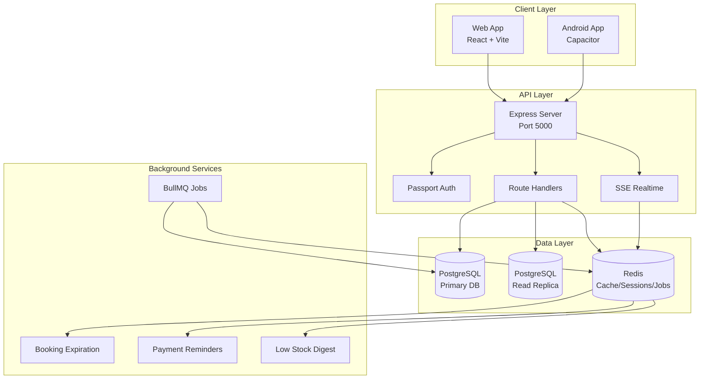
```mermaid
graph TB
    subgraph "Client Layer"
        WEB[Web App<br/>React + Vite]
        MOBILE[Android App<br/>Capacitor]
    end

    subgraph "API Layer"
        EXPRESS[Express Server<br/>Port 5000]
        AUTH[Passport Auth]
        ROUTES[Route Handlers]
        SSE[SSE Realtime]
    end

    subgraph "Data Layer"
        PG[(PostgreSQL<br/>Primary DB)]
        PG_REPLICA[(PostgreSQL<br/>Read Replica)]
        REDIS[(Redis<br/>Cache/Sessions/Jobs)]
    end

    subgraph "Background Services"
        BULLMQ[BullMQ Jobs]
        BOOKING_EXP[Booking Expiration]
        PAYMENT_REM[Payment Reminders]
        LOW_STOCK[Low Stock Digest]
    end

    WEB --> EXPRESS
    MOBILE --> EXPRESS
    EXPRESS --> AUTH
    EXPRESS --> ROUTES
    EXPRESS --> SSE
    ROUTES --> PG
    ROUTES --> PG_REPLICA
    ROUTES --> REDIS
    SSE --> REDIS
    BULLMQ --> PG
    BULLMQ --> REDIS
    REDIS --> BOOKING_EXP
    REDIS --> PAYMENT_REM
    REDIS --> LOW_STOCK
```

### Data Flow

1. **Request Flow**: Client → Express Router → Auth Middleware → Route Handler → Storage → Database
2. **Response Flow**: Database → Storage Layer → Cache (optional) → Route Handler → Client
3. **Realtime Flow**: Database Change → Redis Pub/Sub → SSE Broadcast → Connected Clients
4. **Background Jobs**: Scheduler → BullMQ → Job Handler → Database Update → Notification

---

## 5. Database Schema

### Core Tables

#### `users`
Primary user table supporting multiple roles (customer, shop, provider, worker).

| Column | Type | Description |
|--------|------|-------------|
| id | serial | Primary key |
| username | text | Unique username (optional) |
| password | text | Hashed password (optional for OTP auth) |
| email | text | Email address (unique) |
| phone | text | Phone number (unique) |
| name | text | Display name |
| role | text | customer, shop, provider, worker |
| pin | text | 4-digit PIN for rural auth |
| workerNumber | text | 10-digit worker number |
| language | text | Preferred language (default: ta) |
| profilePicture | text | Profile image URL |
| paymentMethods | jsonb | Array of payment methods |
| verificationStatus | text | unverified, pending, verified, rejected |
| isSuspended | boolean | Account suspension flag |
| latitude/longitude | decimal | User location |
| addressStreet/City/State/PostalCode | text | Address fields |
| upiId | text | UPI payment ID |
| deliveryAvailable | boolean | Offers delivery |
| pickupAvailable | boolean | Offers pickup |
| createdAt | timestamp | Account creation time |

#### `shops`
Separate shop profile table for multi-profile support.

| Column | Type | Description |
|--------|------|-------------|
| id | serial | Primary key |
| ownerId | integer | FK to users.id (unique) |
| shopName | text | Shop display name |
| description | text | Shop description |
| businessType | text | Type of business |
| gstin | text | GST identification number |
| catalogModeEnabled | boolean | Catalog mode flag |
| openOrderMode | boolean | Text order mode flag |
| allowPayLater | boolean | Pay-later support |
| payLaterWhitelist | integer[] | Trusted customer IDs |
| workingHours | jsonb | Operating hours |
| shopLocationLat/Lng | decimal | Shop coordinates |
| createdAt/updatedAt | timestamp | Timestamps |

#### `providers`
Service provider profile table.

| Column | Type | Description |
|--------|------|-------------|
| id | serial | Primary key |
| userId | integer | FK to users.id (unique) |
| businessName | text | Provider business name |
| bio | text | Provider biography |
| experience | text | Experience description |
| languages | text | Languages spoken |
| createdAt/updatedAt | timestamp | Timestamps |

#### `shop_workers`
Links workers to shops with permissions.

| Column | Type | Description |
|--------|------|-------------|
| id | serial | Primary key |
| shopId | integer | FK to users.id (shop owner) |
| workerUserId | integer | FK to users.id (worker) |
| responsibilities | text[] | Permission array |

**Worker Permissions:**
- `products:read` - View products
- `products:write` - Create/edit products
- `inventory:adjust` - Modify stock levels
- `orders:read` - View orders
- `orders:update` - Update order status
- `returns:manage` - Handle return requests
- `promotions:manage` - Manage promotions
- `customers:message` - Contact customers
- `bookings:manage` - Manage bookings
- `analytics:view` - View analytics

#### `services`
Service offerings by providers.

| Column | Type | Description |
|--------|------|-------------|
| id | serial | Primary key |
| providerId | integer | FK to users.id |
| name | text | Service name |
| description | text | Service description |
| price | decimal | Base price |
| duration | integer | Duration in minutes |
| category | text | Service category |
| coverImage | text | Cover image URL |
| images | text[] | Additional images |
| availableAreas | text | Service areas |
| tags | text[] | Search tags |
| workingHours | jsonb | Availability schedule |
| breakTimes | jsonb | Break periods |
| isAvailableNow | boolean | Current availability |
| availabilityNote | text | Unavailability reason |
| allowedSlots | jsonb | Allowed booking slots (morning/afternoon/evening) |
| serviceLocationType | text | customer_location or provider_location |
| isDeleted | boolean | Soft delete flag |
| createdAt/updatedAt | timestamp | Timestamps |

#### `bookings`
Service booking records.

| Column | Type | Description |
|--------|------|-------------|
| id | serial | Primary key |
| customerId | integer | FK to users.id |
| serviceId | integer | FK to services.id |
| bookingDate | timestamp | Scheduled date/time |
| status | text | pending, accepted, rejected, rescheduled, completed, cancelled, expired, disputed |
| timeSlotLabel | text | morning, afternoon, evening |
| serviceLocation | text | customer or provider |
| providerAddress | text | Provider location address |
| totalPrice | decimal | Total booking cost |
| platformFee | decimal | Platform service fee |
| paymentStatus | text | unpaid, paid, refunded, disputed |
| paymentMethod | text | Payment type |
| paymentReference | text | Payment confirmation |
| eReceiptId | text | E-receipt identifier |
| eReceiptUrl | text | E-receipt download URL |
| disputeReason | text | Dispute description |
| expiresAt | timestamp | Expiration for pending bookings |
| createdAt/updatedAt | timestamp | Timestamps |

#### `products`
Shop product inventory.

| Column | Type | Description |
|--------|------|-------------|
| id | serial | Primary key |
| shopId | integer | FK to users.id |
| name | text | Product name |
| description | text | Product description |
| price | decimal | Selling price |
| mrp | decimal | Maximum retail price |
| stock | integer | Current stock level |
| unit | text | Unit of measurement |
| category | text | Product category |
| coverImage | text | Main product image |
| images | text[] | Additional images |
| tags | text[] | Search tags |
| specifications | jsonb | Product specifications |
| isAvailable | boolean | Availability flag |
| lowStockThreshold | integer | Low stock alert level |
| isDeleted | boolean | Soft delete flag |
| searchVector | tsvector | Full-text search index |
| createdAt/updatedAt | timestamp | Timestamps |

#### `orders`
Customer order records.

| Column | Type | Description |
|--------|------|-------------|
| id | serial | Primary key |
| customerId | integer | FK to users.id |
| shopId | integer | FK to users.id |
| orderType | text | product_order or text_order |
| orderText | text | Text for open orders |
| total | decimal | Order total |
| platformFee | decimal | Platform fee |
| status | text | pending, awaiting_customer_agreement, confirmed, processing, packed, dispatched, shipped, delivered, cancelled, refunded |
| paymentStatus | text | unpaid, pending, paid, refunded, disputed |
| paymentMethod | text | upi, cash, pay_later |
| deliveryMethod | text | pickup or delivery |
| deliveryAddress | text | Delivery address |
| trackingInfo | text | Shipment tracking |
| appliedPromotionId | integer | FK to promotions.id |
| discountAmount | decimal | Discount applied |
| returnRequested | boolean | Return flag |
| eReceiptId | text | E-receipt identifier |
| orderDate | timestamp | Order placement time |
| createdAt | timestamp | Record creation time |

#### `order_items`
Individual items within an order.

| Column | Type | Description |
|--------|------|-------------|
| id | serial | Primary key |
| orderId | integer | FK to orders.id |
| productId | integer | FK to products.id |
| name | text | Product name at order time |
| quantity | integer | Quantity ordered |
| price | decimal | Unit price at order time |
| status | text | ordered, returned, refunded |

#### `returns`
Return request records.

| Column | Type | Description |
|--------|------|-------------|
| id | serial | Primary key |
| orderId | integer | FK to orders.id |
| orderItemId | integer | FK to order_items.id |
| customerId | integer | FK to users.id |
| shopId | integer | FK to users.id |
| reason | text | Return reason |
| description | text | Detailed description |
| status | text | requested, approved, rejected, refunded |
| refundAmount | decimal | Refund amount |
| approvedAt | timestamp | Approval time |
| createdAt | timestamp | Request time |

#### `promotions`
Shop promotions and discount codes.

| Column | Type | Description |
|--------|------|-------------|
| id | serial | Primary key |
| shopId | integer | FK to users.id |
| name | text | Promotion name |
| type | text | percentage or fixed |
| value | decimal | Discount value |
| code | text | Promo code |
| usageLimit | integer | Max redemptions |
| usedCount | integer | Current redemptions |
| minOrderValue | decimal | Minimum order |
| maxDiscountValue | decimal | Maximum discount |
| startDate | timestamp | Start date |
| endDate | timestamp | End date |
| isActive | boolean | Active flag |
| applicableProducts | integer[] | Specific products |
| excludedProducts | integer[] | Excluded products |
| createdAt | timestamp | Creation time |

#### `cart`
Customer shopping cart.

| Column | Type | Description |
|--------|------|-------------|
| id | serial | Primary key |
| customerId | integer | FK to users.id |
| productId | integer | FK to products.id |
| quantity | integer | Quantity in cart |

#### `wishlist`
Customer wishlist.

| Column | Type | Description |
|--------|------|-------------|
| id | serial | Primary key |
| customerId | integer | FK to users.id |
| productId | integer | FK to products.id |

#### `reviews`
Service reviews.

| Column | Type | Description |
|--------|------|-------------|
| id | serial | Primary key |
| customerId | integer | FK to users.id |
| serviceId | integer | FK to services.id |
| providerId | integer | FK to users.id |
| rating | integer | 1-5 rating |
| comment | text | Review text |
| isPublic | boolean | Public visibility |
| bookingId | integer | FK to bookings.id |
| createdAt | timestamp | Review time |

#### `product_reviews`
Product reviews.

| Column | Type | Description |
|--------|------|-------------|
| id | serial | Primary key |
| productId | integer | FK to products.id |
| customerId | integer | FK to users.id |
| rating | integer | 1-5 rating |
| comment | text | Review text |
| isVerifiedPurchase | boolean | Verified buyer flag |
| createdAt | timestamp | Review time |

#### `notifications`
User notifications.

| Column | Type | Description |
|--------|------|-------------|
| id | serial | Primary key |
| userId | integer | FK to users.id |
| type | text | booking, order, promotion, system, low_stock, payment, return_request, dispute |
| title | text | Notification title |
| message | text | Notification body |
| data | jsonb | Additional context |
| isRead | boolean | Read status |
| createdAt | timestamp | Creation time |

#### `admin_users`
Admin console users.

| Column | Type | Description |
|--------|------|-------------|
| id | uuid | Primary key |
| email | text | Admin email (unique) |
| password | text | Hashed password |
| roleId | uuid | FK to admin_roles.id |
| name | text | Admin name |
| isActive | boolean | Active status |
| lastLogin | timestamp | Last login time |
| createdAt | timestamp | Creation time |

#### `admin_roles`
Admin role definitions.

| Column | Type | Description |
|--------|------|-------------|
| id | uuid | Primary key |
| name | text | Role name (unique) |
| description | text | Role description |

#### `admin_permissions`
Permission assignments to roles.

| Column | Type | Description |
|--------|------|-------------|
| id | uuid | Primary key |
| roleId | uuid | FK to admin_roles.id |
| resource | text | Resource name |
| action | text | Allowed action |

#### `admin_audit_logs`
Admin action audit trail.

| Column | Type | Description |
|--------|------|-------------|
| id | uuid | Primary key |
| adminId | uuid | FK to admin_users.id |
| action | text | Action performed |
| resource | text | Affected resource |
| createdAt | timestamp | Action time |

---

## 6. User Roles & Permissions

### Role Matrix

| Capability | Customer | Provider | Shop Owner | Worker | Admin |
|------------|:--------:|:--------:|:----------:|:------:|:-----:|
| Browse products/services | ✓ | ✓ | ✓ | ✓ | ✓ |
| Place orders | ✓ | - | - | - | - |
| Book services | ✓ | - | - | - | - |
| Manage cart/wishlist | ✓ | - | - | - | - |
| Submit reviews | ✓ | - | - | - | - |
| Request returns | ✓ | - | - | - | - |
| Create services | - | ✓ | - | - | - |
| Manage bookings | - | ✓ | - | - | - |
| Create products | - | - | ✓ | * | - |
| Manage orders | - | - | ✓ | * | - |
| Manage workers | - | - | ✓ | - | - |
| Create promotions | - | - | ✓ | * | - |
| Handle returns | - | - | ✓ | * | - |
| Platform monitoring | - | - | - | - | ✓ |
| User management | - | - | - | - | ✓ |
| Audit logs | - | - | - | - | ✓ |

*Worker capabilities depend on assigned responsibilities

### Worker Permission Details

Workers are scoped to their assigned shop and can only perform actions based on granted responsibilities:

| Responsibility | Grants Access To |
|---------------|------------------|
| `products:read` | View shop products |
| `products:write` | Create and edit products |
| `inventory:adjust` | Modify stock levels |
| `orders:read` | View shop orders |
| `orders:update` | Update order status, approve pay-later |
| `returns:manage` | View and process returns |
| `promotions:manage` | Create/edit/delete promotions |
| `customers:message` | Send messages to customers |
| `bookings:manage` | Manage service bookings |
| `analytics:view` | View shop analytics |

---

## 7. Authentication Flows

### 7.1 Standard Registration & Login

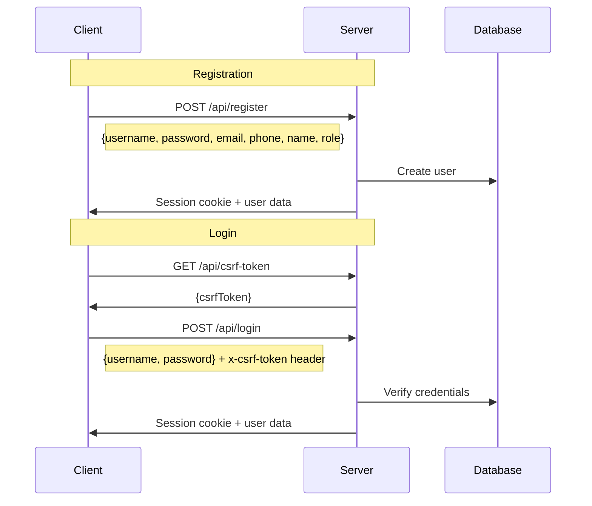
```mermaid
sequenceDiagram
    participant Client
    participant Server
    participant Database

    Note over Client,Server: Registration
    Client->>Server: POST /api/register
    Note right of Client: {username, password, email, phone, name, role}
    Server->>Database: Create user
    Server->>Client: Session cookie + user data

    Note over Client,Server: Login
    Client->>Server: GET /api/csrf-token
    Server->>Client: {csrfToken}
    Client->>Server: POST /api/login
    Note right of Client: {username, password} + x-csrf-token header
    Server->>Database: Verify credentials
    Server->>Client: Session cookie + user data
```

### 7.2 Rural Phone + PIN Authentication

Designed for users in areas with limited internet/literacy:

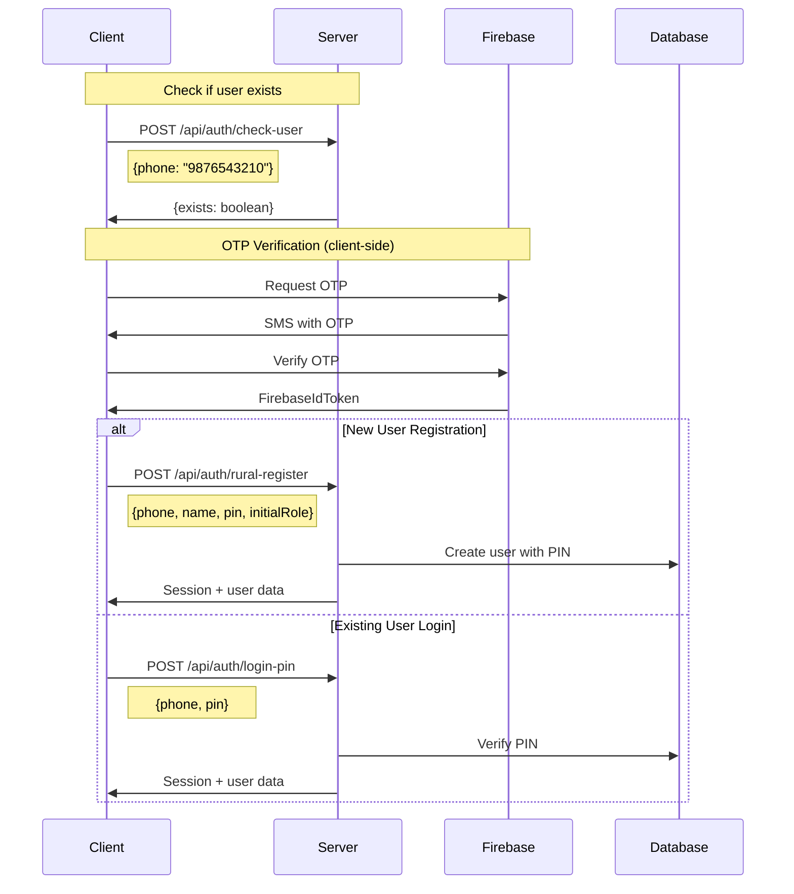
```mermaid
sequenceDiagram
    participant Client
    participant Server
    participant Firebase
    participant Database

    Note over Client,Server: Check if user exists
    Client->>Server: POST /api/auth/check-user
    Note right of Client: {phone: "9876543210"}
    Server->>Client: {exists: boolean}

    Note over Client,Firebase: OTP Verification (client-side)
    Client->>Firebase: Request OTP
    Firebase->>Client: SMS with OTP
    Client->>Firebase: Verify OTP
    Firebase->>Client: FirebaseIdToken

    alt New User Registration
        Client->>Server: POST /api/auth/rural-register
        Note right of Client: {phone, name, pin, initialRole}
        Server->>Database: Create user with PIN
        Server->>Client: Session + user data
    else Existing User Login
        Client->>Server: POST /api/auth/login-pin
        Note right of Client: {phone, pin}
        Server->>Database: Verify PIN
        Server->>Client: Session + user data
    end
```

### 7.3 Worker Login

Shop workers use a separate login flow with their assigned worker number:

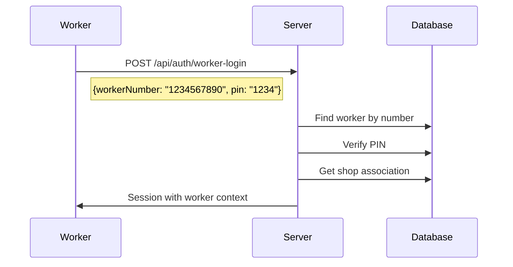
```mermaid
sequenceDiagram
    participant Worker
    participant Server
    participant Database

    Worker->>Server: POST /api/auth/worker-login
    Note right of Worker: {workerNumber: "1234567890", pin: "1234"}
    Server->>Database: Find worker by number
    Server->>Database: Verify PIN
    Server->>Database: Get shop association
    Server->>Worker: Session with worker context
```

### 7.4 Admin Login

Admin console uses a separate session mechanism:

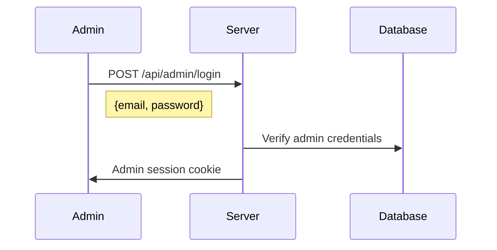
```mermaid
sequenceDiagram
    participant Admin
    participant Server
    participant Database

    Admin->>Server: POST /api/admin/login
    Note right of Admin: {email, password}
    Server->>Database: Verify admin credentials
    Server->>Admin: Admin session cookie
```

### 7.5 Password/PIN Reset

**Server-managed OTP Reset:**
```
POST /api/auth/forgot-password-otp → {phone} → Stores OTP in DB
POST /api/auth/verify-reset-otp → {phone, otp} → Returns resetToken
POST /api/auth/reset-password → {resetToken, newPassword} → Updates password
```

**Firebase-based PIN Reset:**
```
POST /api/auth/reset-pin → {firebaseIdToken, newPin} → Verifies Firebase token, updates PIN
```

### 7.6 CSRF Protection

All non-GET requests require a CSRF token:

1. Client fetches token: `GET /api/csrf-token` → `{csrfToken: "..."}`
2. Client includes header: `x-csrf-token: <token>` on POST/PATCH/DELETE requests
3. Server validates token matches session

---

## 8. API Endpoints Reference

### 8.1 Public Endpoints (No Auth Required)

| Method | Endpoint | Description |
|--------|----------|-------------|
| GET | `/api/health` | Server health check |
| GET | `/api/csrf-token` | Get CSRF token |
| GET | `/api/shops` | List all shops |
| GET | `/api/shops/:shopId` | Get shop details |
| GET | `/api/shops/:shopId/products/:productId` | Get product in shop |
| GET | `/api/products` | Search products |
| GET | `/api/services` | Search services |
| GET | `/api/services/:id` | Get service details |
| GET | `/api/search/global` | Global search |

### 8.2 Authentication Endpoints

| Method | Endpoint | Description |
|--------|----------|-------------|
| POST | `/api/register` | Standard registration |
| POST | `/api/login` | Standard login |
| POST | `/api/logout` | End session |
| GET | `/api/user` | Get current user |
| POST | `/api/delete-account` | Delete user account |
| POST | `/api/auth/check-user` | Check if phone exists |
| POST | `/api/auth/rural-register` | Register with phone + PIN |
| POST | `/api/auth/login-pin` | Login with phone + PIN |
| POST | `/api/auth/reset-pin` | Reset PIN with Firebase token |
| POST | `/api/auth/worker-login` | Worker login |
| POST | `/api/auth/forgot-password-otp` | Request password reset OTP |
| POST | `/api/auth/verify-reset-otp` | Verify reset OTP |
| POST | `/api/auth/reset-password` | Set new password |
| GET | `/api/auth/profiles` | Get user's profiles |
| POST | `/api/auth/create-shop` | Create shop profile |
| POST | `/api/auth/create-provider` | Create provider profile |

### 8.3 Customer Endpoints

| Method | Endpoint | Description |
|--------|----------|-------------|
| POST | `/api/bookings` | Create service booking |
| GET | `/api/bookings/customer/requests` | Pending bookings |
| GET | `/api/bookings/customer/history` | Booking history |
| POST | `/api/orders` | Create product order |
| POST | `/api/orders/text` | Create text-based order |
| GET | `/api/orders/customer` | Customer order history |
| POST | `/api/orders/:orderId/return` | Request return |
| PATCH | `/api/orders/:orderId/cancel` | Cancel order |
| GET | `/api/cart` | Get cart contents |
| POST | `/api/cart` | Add to cart |
| PATCH | `/api/cart/:productId` | Update cart item |
| DELETE | `/api/cart/:productId` | Remove from cart |
| DELETE | `/api/cart` | Clear cart |
| GET | `/api/wishlist` | Get wishlist |
| POST | `/api/wishlist` | Add to wishlist |
| DELETE | `/api/wishlist/:productId` | Remove from wishlist |
| POST | `/api/reviews` | Create service review |
| POST | `/api/products/:productId/reviews` | Create product review |
| POST | `/api/promotions/validate` | Validate promo code |
| POST | `/api/promotions/:id/apply` | Apply promotion |

### 8.4 Provider Endpoints

| Method | Endpoint | Description |
|--------|----------|-------------|
| POST | `/api/services` | Create service |
| PATCH | `/api/services/:id` | Update service |
| DELETE | `/api/services/:id` | Delete service |
| GET | `/api/services/provider/:id` | Get provider's services |
| GET | `/api/bookings/provider/pending` | Pending bookings |
| GET | `/api/bookings/provider/history` | Booking history |
| PATCH | `/api/bookings/:id/status` | Update booking status |
| PATCH | `/api/bookings/:id/provider-complete` | Mark booking complete |
| POST | `/api/services/:id/block-time` | Block time slot |
| GET | `/api/services/:id/blocked-slots` | Get blocked slots |
| DELETE | `/api/services/:id/blocked-slots/:slotId` | Remove blocked slot |
| GET | `/api/services/:id/availability` | Check availability |
| PATCH | `/api/services/:id/toggle-availability` | Toggle availability |

### 8.5 Shop Owner Endpoints

| Method | Endpoint | Description |
|--------|----------|-------------|
| POST | `/api/products` | Create product |
| POST | `/api/products/quick-add` | Quick add product |
| PATCH | `/api/products/:id` | Update product |
| DELETE | `/api/products/:id` | Delete product |
| PATCH | `/api/products/bulk-update` | Bulk update products |
| GET | `/api/orders/shop` | Shop orders |
| GET | `/api/orders/shop/recent` | Recent orders |
| GET | `/api/shops/orders/active` | Active order board |
| PATCH | `/api/orders/:id/status` | Update order status |
| PATCH | `/api/orders/:id/approve-pay-later` | Approve pay-later |
| GET | `/api/returns/shop` | Shop return requests |
| POST | `/api/returns/:id/approve` | Approve return |
| POST | `/api/returns/:id/reject` | Reject return |
| POST | `/api/promotions` | Create promotion |
| PATCH | `/api/promotions/:id` | Update promotion |
| PATCH | `/api/promotions/:id/status` | Toggle promotion |
| DELETE | `/api/promotions/:id` | Delete promotion |
| GET | `/api/promotions/shop/:id` | Shop promotions |
| GET | `/api/shops/pay-later/whitelist` | Get pay-later whitelist |
| POST | `/api/shops/pay-later/whitelist` | Add to whitelist |
| DELETE | `/api/shops/pay-later/whitelist/:customerId` | Remove from whitelist |

### 8.6 Worker Management Endpoints

| Method | Endpoint | Description |
|--------|----------|-------------|
| GET | `/api/shops/workers/responsibilities` | List responsibility presets |
| GET | `/api/shops/workers` | List shop workers |
| POST | `/api/shops/workers` | Create worker |
| GET | `/api/shops/workers/:id` | Get worker details |
| PATCH | `/api/shops/workers/:id` | Update worker |
| DELETE | `/api/shops/workers/:id` | Remove worker |
| GET | `/api/shops/workers/:id/activity` | Worker activity log |

### 8.7 Admin Endpoints

| Method | Endpoint | Description |
|--------|----------|-------------|
| POST | `/api/admin/login` | Admin login |
| POST | `/api/admin/logout` | Admin logout |
| GET | `/api/admin/me` | Current admin info |
| GET | `/api/admin/health-status` | Detailed health |
| GET | `/api/admin/logs` | Application logs |
| GET | `/api/admin/monitoring/summary` | Metrics summary |
| GET | `/api/admin/platform-users` | List all users |
| GET | `/api/admin/platform-users/:userId` | Get user details |
| PATCH | `/api/admin/platform-users/:userId/suspend` | Suspend user |
| PATCH | `/api/admin/platform-users/:userId/unsuspend` | Unsuspend user |
| PATCH | `/api/admin/platform-users/:userId/verify` | Verify user |
| DELETE | `/api/admin/platform-users/:userId` | Delete user |
| GET | `/api/admin/transactions` | Platform transactions |
| GET | `/api/admin/all-orders` | All orders |
| GET | `/api/admin/all-bookings` | All bookings |
| GET | `/api/admin/all-services` | All services |
| GET | `/api/admin/all-products` | All products |
| GET | `/api/admin/roles` | List admin roles |
| POST | `/api/admin/roles` | Create admin role |
| GET | `/api/admin/accounts` | List admin accounts |
| POST | `/api/admin/accounts` | Create admin account |
| PATCH | `/api/admin/accounts/:id/status` | Toggle admin status |
| GET | `/api/admin/audit-logs` | Audit trail |
| GET | `/api/admin/notifications/settings` | Notification settings |
| PATCH | `/api/admin/notifications/settings` | Update settings |

### 8.8 User Profile & Notifications

| Method | Endpoint | Description |
|--------|----------|-------------|
| GET | `/api/events` | SSE event stream |
| GET | `/api/notifications` | Get notifications |
| PATCH | `/api/notifications/:id/read` | Mark as read |
| DELETE | `/api/notifications/:id` | Delete notification |
| POST | `/api/profile/location` | Update location |
| PATCH | `/api/profile` | Update profile |
| POST | `/api/upload` | Upload file |
| POST | `/api/users/upload-qr` | Upload UPI QR code |
| POST | `/api/performance-metrics` | Submit client metrics |

---

## 9. Application Workflows

### 9.1 Customer Product Order Flow

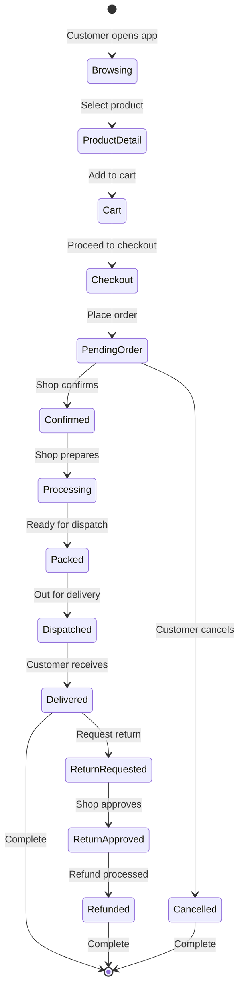
```mermaid
stateDiagram-v2
    [*] --> Browsing: Customer opens app
    Browsing --> ProductDetail: Select product
    ProductDetail --> Cart: Add to cart
    Cart --> Checkout: Proceed to checkout
    Checkout --> PendingOrder: Place order
    
    PendingOrder --> Confirmed: Shop confirms
    PendingOrder --> Cancelled: Customer cancels
    
    Confirmed --> Processing: Shop prepares
    Processing --> Packed: Ready for dispatch
    Packed --> Dispatched: Out for delivery
    Dispatched --> Delivered: Customer receives
    
    Delivered --> ReturnRequested: Request return
    ReturnRequested --> ReturnApproved: Shop approves
    ReturnApproved --> Refunded: Refund processed
    
    Delivered --> [*]: Complete
    Refunded --> [*]: Complete
    Cancelled --> [*]: Complete
```

### 9.2 Text Order Flow (Open Order Mode)

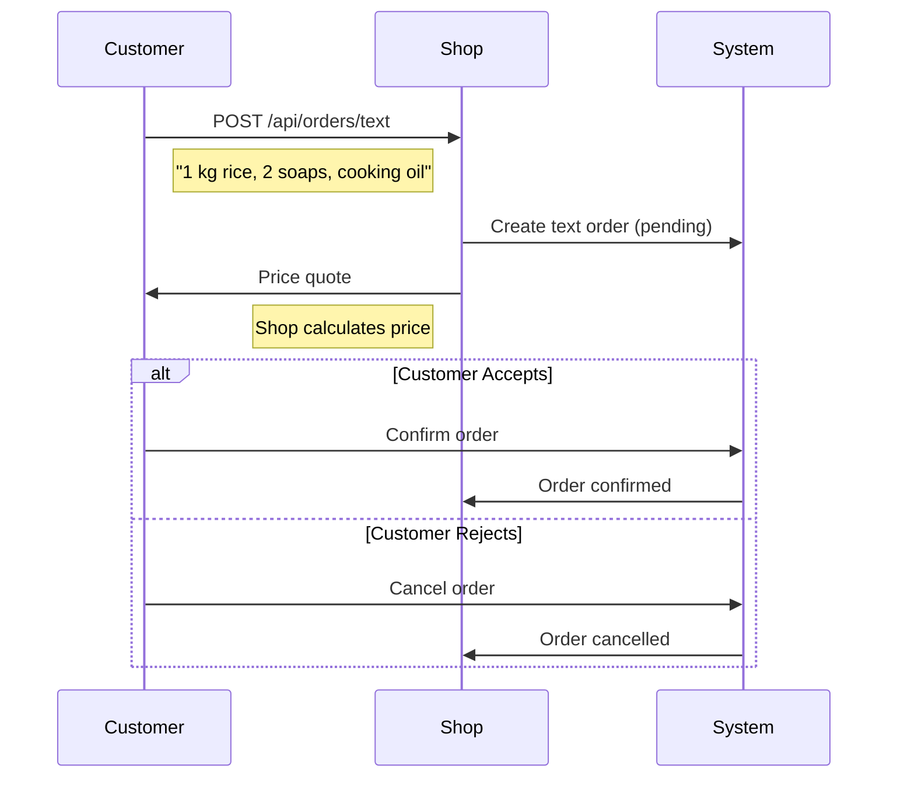
```mermaid
sequenceDiagram
    participant Customer
    participant Shop
    participant System

    Customer->>Shop: POST /api/orders/text
    Note right of Customer: "1 kg rice, 2 soaps, cooking oil"
    Shop->>System: Create text order (pending)
    
    Shop->>Customer: Price quote
    Note left of Shop: Shop calculates price
    
    alt Customer Accepts
        Customer->>System: Confirm order
        System->>Shop: Order confirmed
    else Customer Rejects
        Customer->>System: Cancel order
        System->>Shop: Order cancelled
    end
```

### 9.3 Service Booking Flow

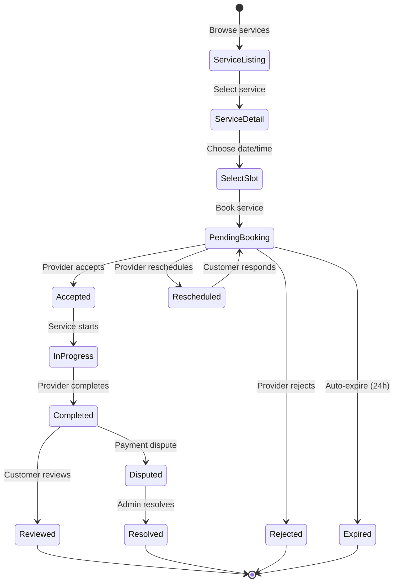
```mermaid
stateDiagram-v2
    [*] --> ServiceListing: Browse services
    ServiceListing --> ServiceDetail: Select service
    ServiceDetail --> SelectSlot: Choose date/time
    SelectSlot --> PendingBooking: Book service
    
    PendingBooking --> Accepted: Provider accepts
    PendingBooking --> Rejected: Provider rejects
    PendingBooking --> Rescheduled: Provider reschedules
    PendingBooking --> Expired: Auto-expire (24h)
    
    Rescheduled --> PendingBooking: Customer responds
    
    Accepted --> InProgress: Service starts
    InProgress --> Completed: Provider completes
    
    Completed --> Reviewed: Customer reviews
    Completed --> Disputed: Payment dispute
    
    Reviewed --> [*]
    Disputed --> Resolved: Admin resolves
    Resolved --> [*]
    Rejected --> [*]
    Expired --> [*]
```

### 9.4 Shop Worker Onboarding

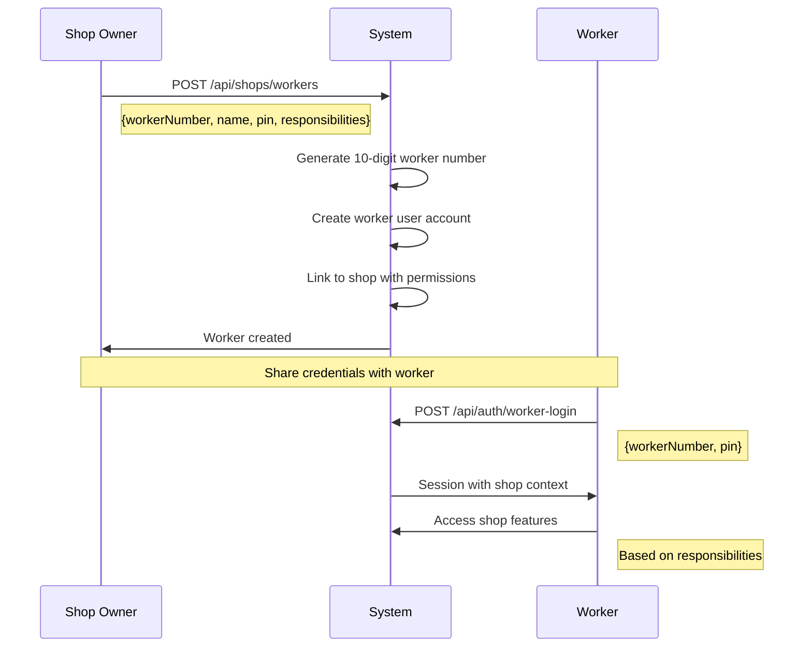
```mermaid
sequenceDiagram
    participant Owner as Shop Owner
    participant System
    participant Worker

    Owner->>System: POST /api/shops/workers
    Note right of Owner: {workerNumber, name, pin, responsibilities}
    System->>System: Generate 10-digit worker number
    System->>System: Create worker user account
    System->>System: Link to shop with permissions
    System->>Owner: Worker created

    Note over Owner,Worker: Share credentials with worker
    
    Worker->>System: POST /api/auth/worker-login
    Note right of Worker: {workerNumber, pin}
    System->>Worker: Session with shop context
    
    Worker->>System: Access shop features
    Note right of Worker: Based on responsibilities
```

### 9.5 Pay-Later Flow

```mermaid
sequenceDiagram
    participant Customer
    participant Shop
    participant System

    Note over Customer,System: Customer places order with pay_later
    Customer->>System: POST /api/orders
    Note right of Customer: paymentMethod: "pay_later"
    
    alt Customer in whitelist
        System->>Shop: Auto-approved
        Shop->>Customer: Order processing
    else Customer not in whitelist
        System->>Shop: Awaiting approval
        Shop->>System: PATCH /api/orders/:id/approve-pay-later
        System->>Customer: Order confirmed
    end
    
    Note over Customer,System: Later payment
    Customer->>Shop: Pay in person
    Shop->>System: Mark as paid
```

---

## 10. Client Application

### 10.1 Directory Structure

```
client/src/
├── components/                # 70+ reusable components
│   ├── ui/                    # Base UI components (Button, Card, Input, etc.)
│   ├── layout/                # Layout components
│   ├── forms/                 # Form components
│   └── [feature]/             # Feature-specific components
├── contexts/
│   ├── AuthContext.tsx        # Authentication state
│   ├── CartContext.tsx        # Shopping cart state
│   └── NotificationContext.tsx # Notification state
├── hooks/
│   ├── use-auth.ts            # Auth hook
│   ├── use-cart.ts            # Cart hook
│   ├── use-toast.ts           # Toast notifications
│   └── use-[feature].ts       # Feature-specific hooks
├── lib/
│   ├── api.ts                 # API client
│   ├── firebase.ts            # Firebase integration
│   ├── queryClient.ts         # TanStack Query setup
│   └── utils.ts               # Utility functions
├── pages/
│   ├── admin/                 # Admin dashboard (13 pages)
│   ├── auth/                  # Authentication (5 pages)
│   ├── customer/              # Customer views (18 pages)
│   ├── provider/              # Provider dashboard (6 pages)
│   └── shop/                  # Shop management (9 pages)
└── App.tsx                    # Root component with routing
```

### 10.2 Page Routes

#### Customer Pages
| Route | Page | Description |
|-------|------|-------------|
| `/` | Home | Landing page |
| `/customer/browse-services` | BrowseServices | Service catalog |
| `/customer/browse-products` | BrowseProducts | Product catalog |
| `/customer/browse-shops` | BrowseShops | Shop directory |
| `/customer/service-details/:id` | ServiceDetails | Service info |
| `/customer/service-provider/:id` | ServiceProvider | Provider info |
| `/customer/shops/:id` | ShopDetail | Shop storefront |
| `/customer/shops/:shopId/products/:productId` | ProductDetail | Product info |
| `/customer/shops/:id/quick-order` | QuickOrder | Text order form |
| `/customer/cart` | Cart | Shopping cart |
| `/customer/checkout` | Checkout | Order checkout |
| `/customer/bookings` | CustomerBookings | Booking management |
| `/customer/orders` | CustomerOrders | Order history |
| `/customer/profile` | CustomerProfile | Profile settings |
| `/customer/wishlist` | Wishlist | Saved products |
| `/customer/notifications` | Notifications | Notification center |

#### Provider Pages
| Route | Page | Description |
|-------|------|-------------|
| `/provider/dashboard` | ProviderDashboard | Provider home |
| `/provider/services` | ServiceManagement | Manage services |
| `/provider/bookings` | BookingManagement | Manage bookings |
| `/provider/calendar` | Calendar | Schedule view |
| `/provider/profile` | ProviderProfile | Provider settings |
| `/provider/reviews` | ProviderReviews | Review management |

#### Shop Pages
| Route | Page | Description |
|-------|------|-------------|
| `/shop/dashboard` | ShopDashboard | Shop home |
| `/shop/products` | ProductManagement | Inventory |
| `/shop/orders` | OrderManagement | Order processing |
| `/shop/workers` | WorkerManagement | Worker accounts |
| `/shop/promotions` | PromotionManagement | Discounts |
| `/shop/returns` | ReturnManagement | Return requests |
| `/shop/analytics` | ShopAnalytics | Sales analytics |
| `/shop/profile` | ShopProfile | Shop settings |
| `/shop/pay-later` | PayLaterSettings | Pay-later config |

#### Admin Pages
| Route | Page | Description |
|-------|------|-------------|
| `/admin/login` | AdminLogin | Admin authentication |
| `/admin/dashboard` | AdminDashboard | Admin home |
| `/admin/users` | UserManagement | Platform users |
| `/admin/orders` | OrderOverview | All orders |
| `/admin/bookings` | BookingOverview | All bookings |
| `/admin/services` | ServiceOverview | All services |
| `/admin/products` | ProductOverview | All products |
| `/admin/transactions` | Transactions | Financial data |
| `/admin/roles` | RoleManagement | Admin roles |
| `/admin/accounts` | AccountManagement | Admin accounts |
| `/admin/logs` | AuditLogs | System logs |
| `/admin/monitoring` | Monitoring | Health metrics |
| `/admin/settings` | Settings | Platform config |

#### Auth Pages
| Route | Page | Description |
|-------|------|-------------|
| `/auth` | AuthPage | Login/register |
| `/auth/rural` | RuralAuthFlow | Phone + PIN auth |
| `/auth/forgot-password` | ForgotPassword | Password reset |
| `/worker-login` | WorkerLogin | Worker auth |

### 10.3 State Management

The application uses **TanStack Query** for server state:

```typescript
// Query keys pattern
const queryKeys = {
  user: ['user'],
  cart: ['cart'],
  wishlist: ['wishlist'],
  products: (filters) => ['products', filters],
  services: (filters) => ['services', filters],
  orders: (customerId) => ['orders', customerId],
  bookings: (userId) => ['bookings', userId],
  notifications: (userId) => ['notifications', userId],
};
```

**Realtime Updates:**
```typescript
// SSE connection for cache invalidation
useEffect(() => {
  const eventSource = new EventSource('/api/events');
  
  eventSource.onmessage = (event) => {
    const data = JSON.parse(event.data);
    if (data.type === 'invalidate') {
      queryClient.invalidateQueries({ queryKey: data.queryKey });
    }
  };
  
  return () => eventSource.close();
}, []);
```

---

## 11. Background Jobs & Realtime

### 11.1 BullMQ Job Queues

The application uses BullMQ with Redis for reliable background job processing:

#### Booking Expiration Job
- **Cron**: `BOOKING_EXPIRATION_CRON` (default: every hour)
- **Action**: Marks pending bookings as "expired" after 24 hours
- **Lock**: `BOOKING_EXPIRATION_LOCK_TTL_MS`

#### Payment Reminder Job
- **Cron**: `PAYMENT_REMINDER_CRON` (default: daily)
- **Action**: Sends reminders for unpaid bookings/orders
- **Escalation**: Marks as "disputed" after `PAYMENT_DISPUTE_DAYS`
- **Lock**: `PAYMENT_REMINDER_LOCK_TTL_MS`

#### Low Stock Digest Job
- **Cron**: `LOW_STOCK_DIGEST_CRON` (default: daily)
- **Action**: Notifies shop owners about products below threshold
- **Lock**: `LOW_STOCK_DIGEST_LOCK_TTL_MS`

### 11.2 Distributed Job Locks

When running multiple API instances, Redis-based locks prevent duplicate job execution:

```typescript
// Lock acquisition pattern
const lockKey = `${JOB_LOCK_PREFIX}:${jobName}`;
const acquired = await redis.set(lockKey, instanceId, 'PX', lockTTL, 'NX');

if (!acquired) {
  // Another instance is running this job
  return;
}

try {
  await runJob();
} finally {
  await redis.del(lockKey);
}
```

### 11.3 SSE Realtime Events

Server-Sent Events provide real-time updates to connected clients:

```typescript
// Client connection
GET /api/events

// Event types
type SSEEvent = {
  type: 'invalidate' | 'notification' | 'heartbeat';
  queryKey?: string[];
  data?: any;
};
```

**Cache Invalidation Flow:**
1. Database mutation occurs (new order, booking status change, etc.)
2. Server publishes event to Redis pub/sub channel
3. All connected API instances receive the event
4. Each instance broadcasts to their SSE clients
5. Clients invalidate relevant TanStack Query caches

**Event Categories:**
- `notifications` - New notification received
- `orders` - Order status changed
- `bookings` - Booking status changed
- `cart` - Cart contents changed
- `products` - Product availability changed

---

## 12. Configuration Reference

### 12.1 Core Environment Variables

| Variable | Required | Default | Description |
|----------|:--------:|---------|-------------|
| `DATABASE_URL` | ✓ | - | PostgreSQL connection string |
| `SESSION_SECRET` | ✓ | - | Session signing secret |
| `ADMIN_EMAIL` | ✓ | - | Bootstrap admin email |
| `ADMIN_PASSWORD` | ✓ | - | Bootstrap admin password |
| `NODE_ENV` | - | development | Environment mode |
| `PORT` | - | 5000 | API server port |
| `HOST` | - | 0.0.0.0 | Bind address |

### 12.2 Database Configuration

| Variable | Default | Description |
|----------|---------|-------------|
| `DATABASE_URL` | - | Primary database connection |
| `DATABASE_REPLICA_URL` | - | Read replica connection |
| `DB_POOL_SIZE` | 50 | Primary connection pool |
| `DB_READ_POOL_SIZE` | 50 | Replica connection pool |
| `DB_SLOW_THRESHOLD_MS` | 200 | Slow query logging threshold |
| `USE_IN_MEMORY_DB` | false | Use in-memory storage |

### 12.3 Session & Security

| Variable | Default | Description |
|----------|---------|-------------|
| `SESSION_STORE` | postgres | postgres or redis |
| `SESSION_TTL_SECONDS` | 86400 | Session lifetime |
| `SESSION_COOKIE_SAMESITE` | lax | Cookie SameSite policy |
| `SESSION_COOKIE_SECURE` | auto | Secure cookie flag |
| `SESSION_COOKIE_DOMAIN` | - | Cookie domain override |

### 12.4 Redis & Rate Limiting

| Variable | Default | Description |
|----------|---------|-------------|
| `REDIS_URL` | - | Redis connection string |
| `DISABLE_REDIS` | false | Disable Redis (dev only) |
| `DISABLE_RATE_LIMITERS` | false | Disable rate limiting |

### 12.5 URLs & CORS

| Variable | Default | Description |
|----------|---------|-------------|
| `FRONTEND_URL` | - | Web app URL |
| `APP_BASE_URL` | - | API base URL |
| `ALLOWED_ORIGINS` | - | Comma-separated CORS list |
| `STRICT_CORS` | false | Enforce CORS in dev |

### 12.6 Client Configuration

| Variable | Default | Description |
|----------|---------|-------------|
| `VITE_API_URL` | - | API URL for client |
| `VITE_FIREBASE_API_KEY` | - | Firebase API key |
| `VITE_FIREBASE_AUTH_DOMAIN` | - | Firebase auth domain |
| `VITE_FIREBASE_PROJECT_ID` | - | Firebase project ID |
| `CAPACITOR_SERVER_URL` | - | Capacitor live reload URL |

### 12.7 Background Jobs

| Variable | Default | Description |
|----------|---------|-------------|
| `BOOKING_EXPIRATION_CRON` | 0 * * * * | Booking expiration schedule |
| `PAYMENT_REMINDER_CRON` | 0 9 * * * | Payment reminder schedule |
| `LOW_STOCK_DIGEST_CRON` | 0 8 * * * | Low stock digest schedule |
| `CRON_TZ` | Asia/Kolkata | Job timezone |
| `PAYMENT_REMINDER_DAYS` | 3 | Days before reminder |
| `PAYMENT_DISPUTE_DAYS` | 7 | Days before dispute |

---

## 13. Deployment Guide

### 13.1 Prerequisites

- Node.js 20.x
- PostgreSQL 14+
- Redis 6+
- PM2 (or alternative process manager)

### 13.2 Quick Start

```bash
# 1. Clone and install
git clone <repository>
cd <project>
npm install

# 2. Configure environment
cp .env_example .env
# Edit .env with your values

# 3. Run migrations
npm run db:migrate

# 4. Start development servers
npm run dev:server  # Backend on :5000
npm run dev:client  # Frontend on :5173
```

### 13.3 Production Deployment

```bash
# 1. Set production environment
export NODE_ENV=production

# 2. Build application
npm run build

# 3. Run migrations
npm run db:migrate

# 4. Start with PM2
pm2 start ecosystem.config.js
pm2 save
pm2 startup
```

### 13.4 Production Checklist

- [ ] Set `NODE_ENV=production`
- [ ] Configure strong `SESSION_SECRET`
- [ ] Set up `ADMIN_EMAIL` and `ADMIN_PASSWORD`
- [ ] Configure `DATABASE_URL` with production credentials
- [ ] Set up `REDIS_URL` for production Redis
- [ ] Configure `FRONTEND_URL`, `APP_BASE_URL`, `ALLOWED_ORIGINS`
- [ ] Set up HTTPS (either in Node or via reverse proxy)
- [ ] Configure backup strategy for PostgreSQL
- [ ] Set up log rotation for `logs/app.log`
- [ ] Configure monitoring alerts for `/api/health`

### 13.5 Health Monitoring

```bash
# Basic health check
curl http://localhost:5000/api/health

# Detailed health (requires admin session)
curl -b admin_cookies.txt http://localhost:5000/api/admin/health-status

# Monitor script
npm run monitor
```

---

## Appendix: Quick Reference

### Common cURL Commands

```bash
# Get CSRF token
CSRF=$(curl -s -c cookies.txt http://localhost:5000/api/csrf-token | jq -r .csrfToken)

# Login
curl -b cookies.txt -c cookies.txt -H "x-csrf-token: $CSRF" \
  -H "Content-Type: application/json" \
  -d '{"username":"demo","password":"Password123!"}' \
  http://localhost:5000/api/login

# Get current user
curl -b cookies.txt http://localhost:5000/api/user

# Browse products
curl "http://localhost:5000/api/products?searchTerm=phone"

# Browse services
curl "http://localhost:5000/api/services?locationCity=Mumbai"
```

### Status Code Reference

| Code | Meaning |
|------|---------|
| 200 | Success |
| 201 | Created |
| 400 | Validation error |
| 401 | Not authenticated |
| 403 | Not authorized |
| 404 | Not found |
| 409 | Conflict (duplicate) |
| 429 | Rate limited |
| 500 | Server error |

### Order Statuses

```
pending → confirmed → processing → packed → dispatched → delivered
                  ↘ cancelled                         ↘ refunded
```

### Booking Statuses

```
pending → accepted → completed
        ↘ rejected
        ↘ rescheduled → pending
        ↘ expired
             ↘ disputed → resolved
```
