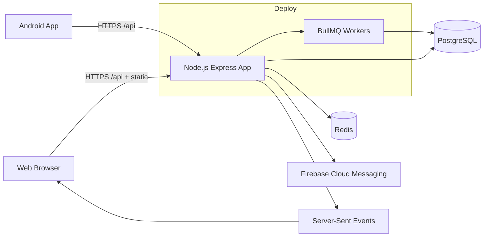
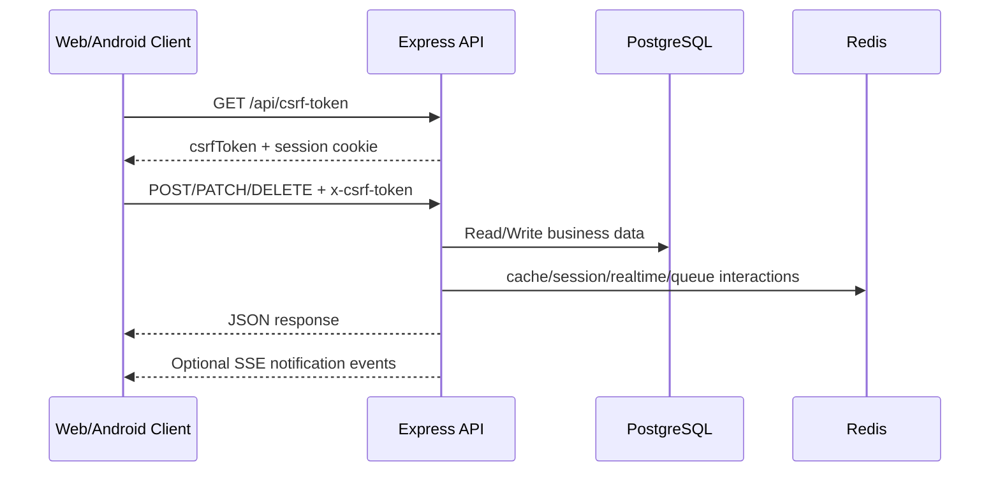
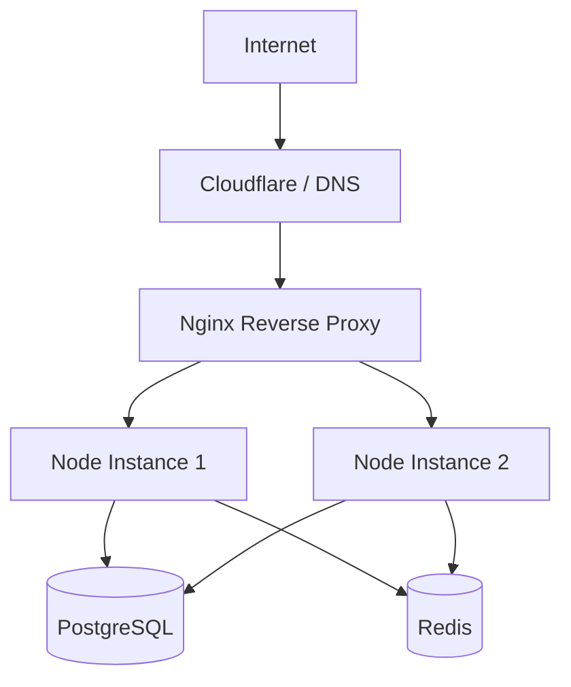

# DoorStep TN Platform Guide

This repository hosts the DoorStep TN platform backend and web app, plus deployment and Android app assets.

This file is the primary source of truth for:
- local setup
- environment and account requirements
- Android setup
- deployment (systemd, PM2, Kubernetes)
- operations and troubleshooting

## Documentation Set

- `README.md` (this file): setup, deployment, environment, and runbook.
- `SOFTWARE_MANUAL.md`: detailed API manual plus backend/frontend/android code map.
- `doorstep-android/README.md`: Android build, signing, release, and store checklist.

## 1. What This Repository Contains

DoorStep TN is a multi-role local commerce platform for:
- product marketplace (shops to customers)
- service booking (providers to customers)
- admin platform operations

Main runtime stack:
- Backend API: Express + TypeScript
- Frontend: React + Vite
- Database: PostgreSQL + Drizzle
- Cache/queues/realtime fanout: Redis + BullMQ + SSE
- Mobile app (native): Kotlin + Jetpack Compose (`doorstep-android/`)

## 2. Architecture

### 2.1 High-Level System Diagram



### 2.2 Runtime Flow Diagram



## 3. Repository Map

```text
client/                 React frontend
server/                 Express API, routes, jobs, services
shared/                 Shared schema/types
migrations/             SQL migrations + drizzle meta
config/                 Network config templates
deploy/                 Nginx, systemd, Kubernetes samples
scripts/                Utility scripts (migrate, checks, tunnel)
doorstep-android/       Native Android app (Kotlin)
```

Note:
- `android/` at repo root is generated local build output and should not be committed.
- `dist/` is generated by `npm run build`.

## 4. Accounts and Services You Need

### 4.1 Mandatory for Development

1. GitHub/Git access to this repository.
2. PostgreSQL instance (local or cloud).
3. Node.js 20.x and npm.

### 4.2 Needed for Full Feature Set

1. Redis (required for production; optional in local API-only testing).
2. Firebase project:
- Phone Auth for OTP flows in client
- FCM for push notifications
- service account JSON for server-side OTP token verification

### 4.3 Needed for Production Deployment

1. VPS or container/Kubernetes environment.
2. Domain + DNS management.
3. TLS certificate setup (for HTTPS).
4. Optional Cloudflare account (if using Cloudflare proxy/tunnel/pages).

### 4.4 Needed for Android Release

1. Google Play Console account.
2. Android keystore (upload/app signing key).
3. Firebase Android app (`google-services.json`).

## 5. Local Machine Prerequisites

Install:

```bash
node -v    # should be v20.x
npm -v
psql --version
redis-server --version   # optional for local if DISABLE_REDIS=true
```

If Redis is not installed locally, set `DISABLE_REDIS=true` in `.env` for development.

## 6. First-Time Local Setup

### 6.1 Clone and install

```bash
git clone <your-repo-url>
cd doorstep-api
npm install
```

### 6.2 Create `.env`

```bash
cp .env_example .env
```

Set at least:

```env
NODE_ENV=development
PORT=5000
DATABASE_URL=postgresql://<user>:<password>@localhost:5432/<db>
SESSION_SECRET=<strong-random-secret>
ADMIN_EMAIL=<real-admin-email>
ADMIN_PASSWORD=<strong-admin-password>
VITE_API_URL=http://localhost:5000
```

If Redis is not available locally:

```env
DISABLE_REDIS=true
SESSION_STORE=postgres
```

### 6.3 Create PostgreSQL database

Example:

```bash
createdb doorstep_dev
```

Then set:

```env
DATABASE_URL=postgresql://localhost:5432/doorstep_dev
```

### 6.4 Run migrations

```bash
npm run db:migrate
```

If attaching to an existing database where schema already exists but migration history table is empty, run:

```bash
npm run db:migrate:baseline
```

### 6.5 Start the app

Use two terminals for full local development:

Terminal 1 (API):

```bash
npm run dev:server
```

Terminal 2 (frontend):

```bash
npm run dev:client
```

Open:
- Frontend: `http://localhost:5173`
- API health: `http://localhost:5000/api/health`
- Swagger UI: `http://localhost:5000/api/docs`

Important behavior:
- `npm run dev` starts only the server.
- `npm run build && npm run start` serves built frontend from `dist/public` through Express.

## 7. Core Command Reference

```bash
npm run dev                # API dev server only
npm run dev:server         # API dev server
npm run dev:client         # Vite frontend dev server
npm run build              # Build frontend + backend bundle
npm run start              # Start production server from dist/
npm run db:generate        # Generate drizzle migration files
npm run db:migrate         # Apply migrations
npm run db:migrate:baseline# Seed drizzle migration history for existing DB
npm run check              # TypeScript check
npm run lint               # ESLint
npm run format             # Prettier
npm run test               # Test suite
npm run test:coverage      # Tests with coverage
npm run monitor            # Live monitoring script
npm run load:regression    # Load regression script
npm run security:checklist # Security checks
```

## 8. Environment Variables (Detailed)

Start from `.env_example` and set values per environment.

### 8.1 Required in Production

```env
NODE_ENV=production
PORT=5000
DATABASE_URL=postgresql://...
SESSION_SECRET=<strong-random-secret>
ADMIN_EMAIL=<real-email>
ADMIN_PASSWORD=<strong-password>
FRONTEND_URL=https://<frontend-domain>
APP_BASE_URL=https://<api-domain>
ALLOWED_ORIGINS=https://<frontend-domain>,https://<api-domain>
REDIS_URL=redis://<host>:6379
```

### 8.2 Commonly Configured

Database and performance:
- `DATABASE_REPLICA_URL`
- `DB_POOL_SIZE`
- `DB_READ_POOL_SIZE`
- `DB_SLOW_THRESHOLD_MS`
- `USE_IN_MEMORY_DB` (mostly test/dev)

Sessions:
- `SESSION_STORE` (`postgres` or `redis`)
- `SESSION_TTL_SECONDS`
- `SESSION_REDIS_PREFIX`
- `SESSION_COOKIE_SAMESITE`
- `SESSION_COOKIE_SECURE`
- `SESSION_COOKIE_DOMAIN`
- `SESSION_TABLE_NAME`
- `SESSION_SCHEMA_NAME`
- `SESSION_AUTO_CREATE_TABLE`
- `SESSION_PRUNE_INTERVAL_SECONDS`

Redis, jobs, and realtime:
- `DISABLE_REDIS`
- `DISABLE_RATE_LIMITERS`
- `BULLMQ_QUEUE_NAME`
- `BOOKING_EXPIRATION_CRON`
- `PAYMENT_REMINDER_CRON`
- `LOW_STOCK_DIGEST_CRON`
- `CRON_TZ`
- `PAYMENT_REMINDER_DAYS`
- `PAYMENT_DISPUTE_DAYS`
- `JOB_LOCK_TTL_MS`
- `BOOKING_EXPIRATION_LOCK_TTL_MS`
- `PAYMENT_REMINDER_LOCK_TTL_MS`
- `LOW_STOCK_DIGEST_LOCK_TTL_MS`
- `JOB_LOCK_PREFIX`
- `DISABLE_JOB_LOCK`
- `JOB_LOCK_FAIL_OPEN`

Routing/network/cors:
- `HOST` or `SERVER_HOST`
- `STRICT_CORS`
- `NETWORK_CONFIG_PATH`
- `DEV_SERVER_BIND`
- `DEV_SERVER_HOST`
- `DEV_SERVER_PORT`
- `DEV_SERVER_HMR_HOST`
- `DEV_SERVER_HMR_PORT`
- `DEV_SERVER_HMR_PROTOCOL`
- `API_PROXY_TARGET`
- `CLIENT_DIST_DIR`
- `DISABLE_STATIC_FILES`

Security/HTTPS:
- `HTTPS_ENABLED`
- `HTTPS_KEY_PATH`
- `HTTPS_CERT_PATH`
- `HTTPS_PASSPHRASE`
- `HTTPS_CA_PATH`
- `API_LEGACY_SUNSET_DATE`

Logging/monitoring:
- `LOG_LEVEL`
- `LOG_FILE_PATH`
- `LOG_TO_STDOUT`
- `LIVE_MONITOR_URL`
- `READINESS_TIMEOUT_MS`
- `SHUTDOWN_TIMEOUT_MS`

Firebase server-side:
- `FIREBASE_SERVICE_ACCOUNT_PATH`
- `ALLOW_MOCK_FIREBASE_TOKENS` (test/dev only)
- `ENABLE_FIREBASE_ADMIN_IN_TEST`

Frontend build/runtime:
- `VITE_API_URL`
- `VITE_APP_BASE_URL`
- `VITE_FALLBACK_API_URL`
- `VITE_ENABLE_DEBUG_LOGS`
- `VITE_ENABLE_PERMISSION_DEBUG`
- `VITE_FIREBASE_API_KEY`
- `VITE_FIREBASE_AUTH_DOMAIN`
- `VITE_FIREBASE_PROJECT_ID`
- `VITE_FIREBASE_STORAGE_BUCKET`
- `VITE_FIREBASE_MESSAGING_SENDER_ID`
- `VITE_FIREBASE_APP_ID`
- `VITE_FIREBASE_VAPID_KEY`

## 9. Authentication, Sessions, and CSRF

- API uses cookie sessions.
- For state-changing requests (`POST`, `PUT`, `PATCH`, `DELETE`), include `x-csrf-token`.
- Fetch token from `GET /api/csrf-token`.
- Frontend request helpers in `client/src/lib/queryClient.ts` already implement this flow.

Quick manual flow:

```bash
CSRF=$(curl -s -c cookies.txt http://localhost:5000/api/csrf-token | jq -r .csrfToken)

curl -s -b cookies.txt -c cookies.txt \
  -H "x-csrf-token: $CSRF" \
  -H "Content-Type: application/json" \
  -X POST http://localhost:5000/api/login \
  -d '{"username":"demo","password":"StrongPassword123!"}'
```

## 10. Android Setup (Summary)

Native Android app is under `doorstep-android/`.

Use this sequence:

```bash
cd doorstep-android
./gradlew test
./gradlew assembleDebug
```

Detailed Android instructions, release signing, Firebase setup, and Play Store packaging are in:
- [`doorstep-android/README.md`](doorstep-android/README.md)

## 11. Deployment Guide (Detailed)

### 11.1 Deployment Topology Diagram



### 11.2 Option A: Single VPS with systemd (recommended baseline)

### Step 1: Provision server dependencies

```bash
sudo apt update
sudo apt install -y git curl build-essential nginx
curl -fsSL https://deb.nodesource.com/setup_20.x | sudo -E bash -
sudo apt install -y nodejs
```

Install PostgreSQL and Redis (or use managed services).

### Step 2: Create app directory and user

```bash
sudo useradd -r -s /bin/false doorstep || true
sudo mkdir -p /opt/doorstep
sudo chown -R $USER:$USER /opt/doorstep
cd /opt/doorstep
```

### Step 3: Deploy code

```bash
git clone <your-repo-url> .
npm install
cp .env_example .env
```

Edit `.env` for production values.

### Step 4: Build and migrate

```bash
npm run build
npm run db:migrate
```

### Step 5: Install systemd unit

Use provided file:
- `deploy/systemd/doorstep-api.service`

Install:

```bash
sudo cp deploy/systemd/doorstep-api.service /etc/systemd/system/doorstep-api.service
sudo sed -i 's|/opt/doorstep|/opt/doorstep|g' /etc/systemd/system/doorstep-api.service
sudo systemctl daemon-reload
sudo systemctl enable doorstep-api
sudo systemctl start doorstep-api
sudo systemctl status doorstep-api
```

### Step 6: Configure Nginx reverse proxy

Use provided template:
- `deploy/nginx-load-balancer.conf`

Install:

```bash
sudo cp deploy/nginx-load-balancer.conf /etc/nginx/conf.d/doorstep-api.conf
sudo nginx -t
sudo systemctl reload nginx
```

### Step 7: HTTPS

Use your preferred TLS method (Certbot or Cloudflare origin cert). Ensure:
- API is reachable via `https://<api-domain>`
- `APP_BASE_URL` and `ALLOWED_ORIGINS` use HTTPS URLs

### 11.3 Option B: PM2 runtime

Use included ecosystem file:
- `ecosystem.config.js`

Commands:

```bash
npm run build
npx pm2 start ecosystem.config.js
npx pm2 save
npx pm2 startup
```

If you use cluster mode with PM2, keep Redis enabled for shared session/realtime behavior.

### 11.4 Option C: Kubernetes

Use provided manifest:
- `deploy/k8s/doorstep-api.yaml`

Apply:

```bash
kubectl apply -f deploy/k8s/doorstep-api.yaml
```

Then configure:
- image reference (`your-registry/doorstep-api:latest`)
- environment variables via ConfigMap/Secret
- Ingress, TLS, autoscaling, and persistent dependencies (DB/Redis)

### 11.5 Option D: Cloudflare tunnel (quick external exposure)

Script available:
- `scripts/start_cloudflare_tunnel.sh`

Usage:

```bash
chmod +x scripts/start_cloudflare_tunnel.sh
./scripts/start_cloudflare_tunnel.sh
```

This builds the app, starts API, then runs `cloudflared tunnel --url http://localhost:5000`.

## 12. Production Readiness Checklist

Before go-live, verify all:

1. `NODE_ENV=production`
2. strong `SESSION_SECRET`
3. strong `ADMIN_EMAIL` and `ADMIN_PASSWORD`
4. explicit `ALLOWED_ORIGINS` (no wildcard in production)
5. `REDIS_URL` configured and reachable
6. DB migrations applied
7. health checks return OK:
- `/api/health`
- `/api/health/ready`
8. HTTPS enabled at edge/proxy
9. logs are collected and rotated
10. backups for PostgreSQL are configured

## 13. Operations and Troubleshooting

### 13.1 Health and readiness

- `GET /api/health` for liveness/basic runtime
- `GET /api/health/ready` validates dependencies (DB, Redis, BullMQ readiness)

### 13.2 Common failures

1. `DATABASE_URL environment variable is required`
- Fix `.env` and restart.

2. Static frontend not served
- Run `npm run build`.
- Ensure `dist/public/index.html` exists.

3. CORS blocked in production
- Set `ALLOWED_ORIGINS` correctly.
- Confirm `FRONTEND_URL` and `APP_BASE_URL` match real domains.

4. OTP verification not working server-side
- Set `FIREBASE_SERVICE_ACCOUNT_PATH`.
- Ensure service account JSON exists and is readable.

5. Admin bootstrap fails at startup
- Set secure non-default `ADMIN_EMAIL` and `ADMIN_PASSWORD`.

### 13.3 Logs

Default log file path:
- `logs/app.log`

Key toggles:
- `LOG_LEVEL`
- `LOG_TO_STDOUT`
- `LOG_FILE_PATH`

## 14. Security Notes

1. Never commit `.env`, Firebase service account JSON, or keystores.
2. Keep secrets in secret manager/CI variables for production.
3. Use strong admin credentials and rotate periodically.
4. Use HTTPS only for production traffic.
5. Keep dependencies patched and run `npm audit` in CI.

## 15. API Discovery

- Swagger UI: `/api/docs`
- Versioned API prefix compatibility: `/api/v1/*`
- Legacy prefix `/api/*` still supported with deprecation headers

---

For deep internals and module-by-module documentation, see [`SOFTWARE_MANUAL.md`](SOFTWARE_MANUAL.md).

For native Android details, see [`doorstep-android/README.md`](doorstep-android/README.md).
