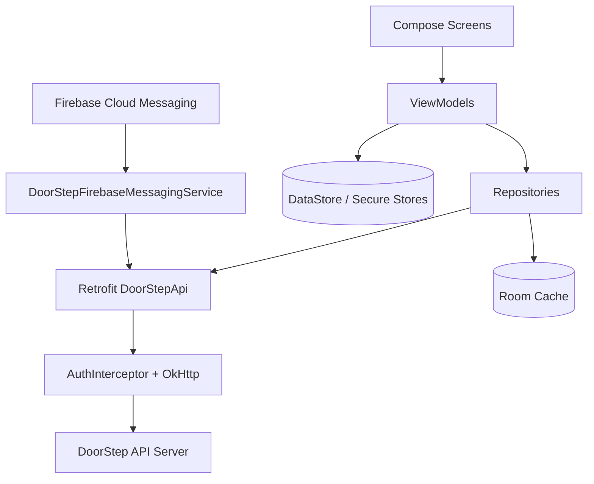

# DoorStep TN Native Android App Guide

This folder contains the native Android application for DoorStep TN.

For cross-project architecture/API/backend/frontend mapping, also read `../SOFTWARE_MANUAL.md`.

Tech stack:
- Kotlin
- Jetpack Compose (Material 3)
- Hilt DI
- Retrofit + OkHttp + Moshi
- Room + DataStore
- Firebase Auth + Firebase Messaging

## 1. Architecture



## 2. Project Configuration

From `app/build.gradle.kts`:
- `applicationId`: `com.doorstep.tn`
- `compileSdk`: 35
- `minSdk`: 26
- `targetSdk`: 35
- Java/Kotlin target: 17

Release builds enforce validation for:
- `VERSION_CODE`
- `API_CERT_PINS`
- `RELEASE_KEYSTORE_FILE`
- `RELEASE_KEYSTORE_PASSWORD`
- `RELEASE_KEY_ALIAS`
- `RELEASE_KEY_PASSWORD`

If missing, release build fails by design.

## 3. Required Accounts and External Setup

### 3.1 Mandatory

1. Firebase project
- Android app registration in Firebase console
- download `google-services.json`

2. DoorStep backend API environment
- reachable HTTPS API domain (default in code: `https://api.doorsteptn.in`)

### 3.2 For Production Release

1. Google Play Console account
2. Upload/signing keystore
3. SSL pin values (`API_CERT_PINS`) if certificate pinning is enabled

## 4. Local Prerequisites

Install:
- Android Studio (latest stable)
- Android SDK Platform 35
- JDK 17

Check tooling:

```bash
cd doorstep-android
./gradlew --version
```

## 5. First-Time Setup

### 5.1 Firebase file

Place Firebase Android config at:

```text
doorstep-android/app/google-services.json
```

Do not commit this file.

### 5.2 Local SDK path

Create `local.properties` (Android Studio usually generates this automatically):

```properties
sdk.dir=/absolute/path/to/Android/Sdk
```

### 5.3 Open in Android Studio

Open folder:

```text
doorstep-android/
```

Let Gradle sync complete.

## 6. Build and Run (Debug)

From CLI:

```bash
cd doorstep-android
./gradlew clean assembleDebug
```

Debug APK output:

```text
doorstep-android/app/build/outputs/apk/debug/doorsteptn-debug.apk
```

Run unit tests:

```bash
./gradlew test
```

## 7. API and Networking Behavior

### 7.1 API base URL

`API_BASE_URL` is defined in `app/build.gradle.kts` (currently `https://api.doorsteptn.in` for debug and release).

If you need local backend testing, change debug `API_BASE_URL` to your local/QA URL and rebuild.

### 7.2 Session and CSRF handling

The app uses cookie-session + CSRF, same as web:
- `AuthInterceptor` automatically fetches `/api/csrf-token`
- adds `X-CSRF-Token` for state-changing methods
- retries once on 403 CSRF failures

### 7.3 TLS and pinning

- cleartext traffic is disabled (`network_security_config.xml`)
- optional certificate pinning uses `API_CERT_PINS`

## 8. Firebase Auth and Push

### 8.1 Phone auth

Firebase Auth dependency is enabled. Ensure phone auth is enabled in Firebase Console.

### 8.2 Push notifications

`DoorStepFirebaseMessagingService`:
- receives/refreshes FCM token
- registers token to backend (`/api/fcm/register`)
- shows foreground notifications

For push to work end-to-end:
1. Firebase Messaging enabled in project
2. App includes valid `google-services.json`
3. Backend endpoints for token registration/dispatch reachable

## 9. Release Build (AAB/APK)

Use `release.env.example` as template.

### 9.1 Prepare release env

```bash
cd doorstep-android
cp release.env.example release.env
```

Fill real values in `release.env`:
- `VERSION_CODE`
- `VERSION_NAME`
- `API_CERT_PINS`
- `RELEASE_KEYSTORE_FILE`
- `RELEASE_KEYSTORE_PASSWORD`
- `RELEASE_KEY_ALIAS`
- `RELEASE_KEY_PASSWORD`

### 9.2 Build release bundle

```bash
set -a
source ./release.env
set +a
./gradlew clean bundleRelease
```

AAB output:

```text
doorstep-android/app/build/outputs/bundle/release/app-release.aab
```

APK release build:

```bash
./gradlew assembleRelease
```

Release APK output (renamed by task):

```text
doorstep-android/app/build/outputs/apk/release/doorsteptn-release.apk
```

## 10. Play Store Submission Checklist

1. Build signed `.aab`
2. Upload to Play Console internal track first
3. Verify login, booking, order, and push flows on real device
4. Confirm production API domain + SSL pins
5. Roll out staged percentage before full rollout

## 11. Common Issues

1. `Execution failed for task ... validateReleaseBuildConfig`
- missing required release variables in `release.env`.

2. Firebase classes unavailable / runtime push failure
- missing `google-services.json` or Firebase setup incomplete.

3. API calls fail due to domain/SSL mismatch
- verify `API_BASE_URL` and `API_CERT_PINS`.

4. CSRF 403 on write requests
- confirm backend reachable and session cookies not blocked.

## 12. Security Notes

1. Never commit:
- `release.env`
- keystore files (`.jks`, `.keystore`)
- `google-services.json`

2. Keep signing keys in secure secret storage.

3. Rotate compromised keys immediately and issue app update.
